```{r setup, include=FALSE}
options(htmltools.dir.version = FALSE)

htmltools::tagList(rmarkdown::html_dependency_jquery())

library(tidyverse)
library(kableExtra)
library(ggplot2)
library(plotly)
library(htmlwidgets)
library(MASS)
library(ggpubr)
library(xaringanthemer)
library(xaringanExtra)

style_duo_accent(
  primary_color = "#621C37",
  secondary_color = "#EE0071",
  background_image = "blank.png"
)

xaringanExtra::use_xaringan_extra(c("tile_view"))

use_scribble(
  pen_color = "#EE0071",
  pen_size = 4
)

knitr::opts_chunk$set(
  fig.retina = TRUE,
  warning = FALSE,
  message = FALSE
)
```

name: Title slide
class: middle, left
<br><br><br><br><br><br><br>
# Statistik I
***
### Einheit 5: Stichprobe, Grundgesamtheit - Wahrscheinlichkeitstheorie und Verteilungen
##### Sommersemester 2026 | Prof. Dr. Stephan Goerigk

---
class: top, left
### Stichprobe, Grundgesamtheit - Wahrscheinlichkeitstheorie und Verteilungen 

#### Wiederholung:

**Inferenzstatistik:**

* Umfasst alle statistischen Verfahren, die es erlauben, trotz der Informationsunvollständigkeit der Stichprobendaten Aussagen über eine Population zu treffen.

**Population:**

* Gesamtheit aller Merkmalsträger:innen, auf die eine Untersuchungsfrage gerichtet ist.

**Stichprobe:**

* Auswahl bestimmter Merkmalsträger:innen aus einer Population

---
class: top, left
### Stichprobe, Grundgesamtheit - Wahrscheinlichkeitstheorie und Verteilungen 

#### Wiederholung:

<small>

**Problem:**

* Wenn nur ein Teil der Grundgesamtheit erfasst wird, z.B. 100 Personen, ist die **Informationslage** in Bezug auf die Untersuchungsfrage **unvollständig**. Wir können nicht einfach deskriptiv-statistische Methoden verwenden.

* Wie kann man trotzdem Aussagen treffen, die sich auf alle Personen der Grundgesamtheit beziehen, obwohl nur die Daten einer Stichprobe vorliegen?

***

**Idee:**

* Wir ziehen die Personen zufällig aus der Population in die Stichprobe.

* Wir greifen auf mathematische Methoden zur Formalisierung von Zufallsprozessen zurück $\rightarrow$ Wahrscheinlichkeitstheorie

* Aus diesen ergeben sich Methoden, die Rückschlüsse von der Stichprobe auf die Population erlauben $\rightarrow$ Inferenzstatistik

---
class: top, left
### Stichprobe, Grundgesamtheit - Wahrscheinlichkeitstheorie und Verteilungen 

#### Logik des Schließens von Stichprobe auf Population (Einzelschritte folgen)

.center[
```{r eval = TRUE, echo = F, out.width = "450px"}
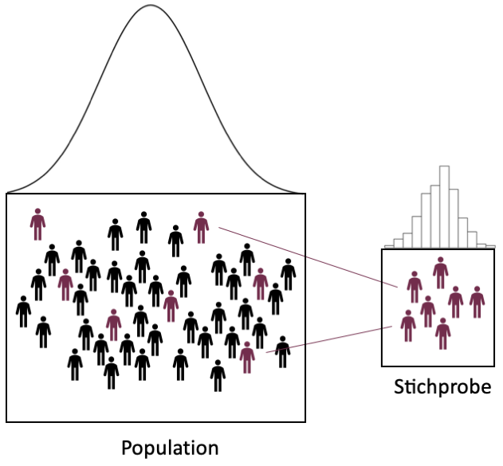
```
]

---
class: top, left
### Stichprobe, Grundgesamtheit - Wahrscheinlichkeitstheorie und Verteilungen 

#### Logik des Schließens von Stichprobe auf Population (Einzelschritte folgen)

.center[
```{r eval = TRUE, echo = F, out.width = "900px"}
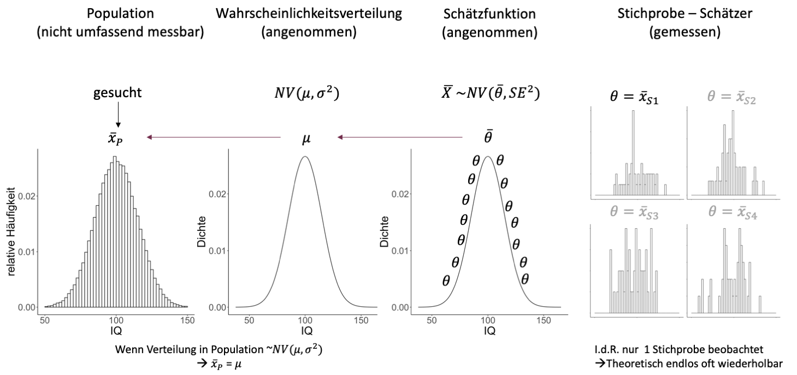
```
]

---
class: top, left
### Stichprobe, Grundgesamtheit - Wahrscheinlichkeitstheorie und Verteilungen

#### Wahrscheinlichkeitsrechnung als Grundlage der Inferenzstatistik

<small>

**Inferenzstatistik:**

* Schluss von Zufallsstichprobe auf Population

* Grundlage: Wahrscheinlichkeitsrechnung

* Zentral: Zufallsprozesse (Ausgang unsicher, nicht mit Sicherheit vorhersagbar)

***

**Wahrscheinlichkeitsrechnung:**

.center[*Mathematik ist der Versuch, alles zu bändigen, auch den Zufall.*

Rudolf Taschner]

* Statistischer Wahrscheinlichkeitsbegriff geht zurück auf 17. Jahrhundert (Frankreich)

* Im Jahr 1654 wandte sich der Glücksspieler Chevalier de Mere mit mehreren Fragen an den französischen Mathematiker Blaise Pascal

---
class: top, left
### Stichprobe, Grundgesamtheit - Wahrscheinlichkeitstheorie und Verteilungen

#### Wahrscheinlichkeitsrechnung als Grundlage der Inferenzstatistik

**Stochastik:**

* Stochastik = die Kunst des Vermutens (altgriechisch)

* Mathematik setzt Vorstellung von Zufall voraus (= Modelle von Situationen, deren Ausgang unsicher ist)

* Keine Einzelereignisse vorhersagbar, aber:

* Erkennen von Regelmäßigkeiten bei Vorgängen, deren Ergebnisse vom Zufall abhängen.

* Zentraler Begriff: Zufallsexperiment

---
class: top, left
### Stichprobe, Grundgesamtheit - Wahrscheinlichkeitstheorie und Verteilungen

#### Wahrscheinlichkeitsrechnung als Grundlage der Inferenzstatistik

**Zufallsexperiment:**

Im Prinzip beliebig oft wiederholbarer Vorgang, der nach bestimmter Vorschrift ausgeführt wird, wobei das Ergebnis vom Zufall abhängt, d.h. der Ausgang kann nicht eindeutig im Voraus bestimmt werden.

* Folge von gleichartigen, voneinander unabhängigen Versuchen möglich.

* Entweder Folge voneinander unabhängiger Versuche mit einem Objekt oder jeweils einmaliger Versuche mit ”gleichartigen” (unabhängigen) Objekten.

Beispiele:

1. Ein Würfel wird wiederholte Male geworfen und es wird beobachtet, wie oft jede Zahl kommt.

2. Parteipräferenz bei weiblichen Jugendlichen zwischen 16 und 18 Jahren.

---
class: top, left
### Stichprobe, Grundgesamtheit - Wahrscheinlichkeitstheorie und Verteilungen

#### Wahrscheinlichkeitsrechnung als Grundlage der Inferenzstatistik

**Zufallsexperiment - Nomenklatur:**

* Die möglichen Ergebnisse eines Zufallsexperimentes heißen Elementarereignisse ω

* Die Menge aller möglichen Ergebnisse eines Zufallsexperimentes bezeichnet man als Ereignisraum Ω.

* Beispiel: ’Einmaliges Würfeln’: Elementarereignisse sind {1}, {2}, {3}, {4}, {5}, {6}. Ereignisraum $Ω = {1, 2, 3, 4, 5, 6}$.

* Ereignis A: Teilmenge des Ereignisraums, z.B. alle geraden Augenzahlen beim Würfeln. Es gilt: $ω ∈ A, A ⊂ Ω$

* Sicheres Ereignis: Jenes Ereignis, welches unter gegebenen Bedingungen immer eintritt.

* Unmögliches Ereignis: Jenes Ereignis, welches unter gegebenen Bedingungen nie eintritt.

---
class: top, left
### Stichprobe, Grundgesamtheit - Wahrscheinlichkeitstheorie und Verteilungen

#### Wahrscheinlichkeitsrechnung als Grundlage der Inferenzstatistik

**Definition der statistischen Wahrscheinlichkeit:**

<small>

Die Wahrscheinlichkeit für das Auftreten eines Ereignisses A, $P_{(A)}$, ist jener Wert, bei dem sich die relative Häufigkeit $r_{n}(A)$ bei
$n$ $\rightarrow$ ∞ Versuchen unter gleichen Bedingungen stabilisiert.

Die mathematische Formulierung:

.center[
```{r eval = TRUE, echo = F, out.width = "250px"}
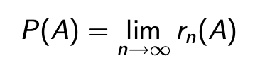
```
]

***

In anderen Worten:

* Die Wahrscheinlichkeit eines Ereignisses gibt an, mit welcher relativen Häufigkeit das Ereignis einträte, wenn man den Versuch theoretisch unendlich oft wiederholen würde.

* Sie sagt jedoch nichts darüber aus, wie häufig das Ereignis bei einer kleinen Anzahl von Versuchen, z.B. $n = 5$, auftritt.

---
class: top, left
### Stichprobe, Grundgesamtheit - Wahrscheinlichkeitstheorie und Verteilungen

#### Wahrscheinlichkeitsrechnung als Grundlage der Inferenzstatistik

**Laplace-Wahrscheinlichkeit**


Bei Zufallsexperimenten, bei denen nur endlich viele, gleichwahrscheinliche Ergebnisse möglich sind, ergibt sich für ein beliebiges Ereignis A die Wahrscheinlichkeit $P(A):$

.center[
```{r eval = TRUE, echo = F, out.width = "750px"}
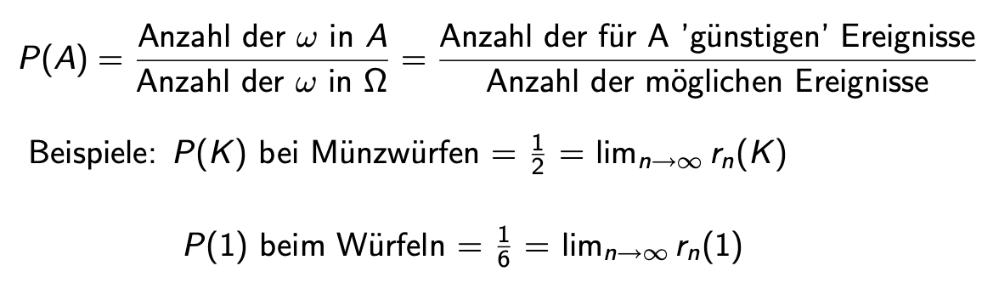
```
]

---
class: top, left
### Stichprobe, Grundgesamtheit - Wahrscheinlichkeitstheorie und Verteilungen

#### Wahrscheinlichkeitsrechnung als Grundlage der Inferenzstatistik

**Axiome der Wahrscheinlichkeitsrechnung nach Kolmogoroff**

Wahrscheinlichkeiten lassen sich durch drei Eigenschaften, die auch für relative Häufigkeiten gelten, und aus denen sich alle Rechenregeln für Wahrscheinlichkeiten ableiten lassen, charakterisieren:


1. Für die Wahrscheinlichkeit eines Ereignisses **gilt stets**: 
$$0 ≤ P_{(A)} ≤ 1$$

2. Die Wahrscheinlichkeit eines **sicheren Ereignisses** beträgt 
$$P_{(Ω)} = 1$$

3. **Additionsregel der Wahrscheinlichkeit:** Die Wahrscheinlichkeit, dass eines von $k$ einander ausschließenden Ereignissen auftritt, ist die Summe der einzelnen Wahrscheinlichkeiten $P_{(A_{1})}, P_{(A_{2})}, . . . , P_{(A_{k})}$.

$$P_{(A_{1} ∨ A_{2} ∨...∨ A_{k})}=P_{(A_{1})} + P_{(A_{2})} +...+ P_{(A_{k})}$$
---
class: top, left
### Stichprobe, Grundgesamtheit - Wahrscheinlichkeitstheorie und Verteilungen

#### Wahrscheinlichkeitsrechnung als Grundlage der Inferenzstatistik

**Rechenregeln: Unmögliches Ereignis**

* Die Wahrscheinlichkeit des unmöglichen Ereignisses B beträgt 
$$P_{(B)} = 0$$
 
* Wenn B ein unmögliches Ereignis ist, kann es nie eintreten: 
$$rn_{(B)} = 0 → P_{(B)} = 0$$

ACHTUNG: 

* Aus $P_{(B)} = 0$ folgt nicht, dass B ein unmögliches Ereignis ist. 

* Das bedeutet nur, dass der Grenzwert der relativen Häufigkeit bei $n → ∞$ Null ist, woraus aber nicht folgt, dass B nie eintreten kann! (Analoges gilt für $P_{(A)} = 1$).

---
class: top, left
### Stichprobe, Grundgesamtheit - Wahrscheinlichkeitstheorie und Verteilungen

#### Wahrscheinlichkeitsrechnung als Grundlage der Inferenzstatistik

**Rechenregeln: Komplementärereignis**

* $P_{(A)}+P_{(\bar{A})}=1, \quad P_{(\bar{A})}=1-P_{(A)}$

* $\bar{A}$ tritt immer dann ein, wenn $A$ nicht eintritt → $r_{n}(A) + r_{n}(\bar{A}) = 1$

***

Beispiel - Münzwurf: 

$P_{(K)} + P_{(Z)} = 0.5 + 0.5 = 1$


---
class: top, left
### Stichprobe, Grundgesamtheit - Wahrscheinlichkeitstheorie und Verteilungen

#### Wahrscheinlichkeitsrechnung als Grundlage der Inferenzstatistik

**Stochastische Unabhängigkeit von Ereignissen**

* Beim Ziehen mit Zurücklegen sind die einzelnen Wahrscheinlichkeiten gleich und die Ziehungen stochastisch unabhängig.

* Beim Ziehen ohne Zurücklegen ändern sich mit jeder Ziehung die Anteile der ’günstigen’ $ω_i$ , und daher auch die Wahrscheinlichkeiten. Die Ziehungen sind daher stochastisch abhängig.

---
class: top, left
### Stichprobe, Grundgesamtheit - Wahrscheinlichkeitstheorie und Verteilungen

#### Wahrscheinlichkeitsrechnung als Grundlage der Inferenzstatistik

**Zufallsexperiment**

* Jedes mögliche Ergebnis aus einem Zufallsexperiment nennen wir ein Elementarereignis $ω$

* Die Menge aller möglichen Ereignisse ist definiert als der Ereignisraum $Ω$

* Der Ereignisraum $Ω$ heißt diskret, wenn er aus abzählbar vielen Elementarereignissen besteht

* Der Ereignisraum $Ω$ heißt stetig, wenn er aus überabzählbar vielen Elementarereignissen besteht

* Zufallsexperiment ist ein allgemeiner Begriff, der Grundlage für die Inferenzstatistik ist


---
class: top, left
### Stichprobe, Grundgesamtheit - Wahrscheinlichkeitstheorie und Verteilungen

#### Psychologische Fragestellungen:

* Praktisch alle psychologischen Theorien enthalten Aussagen über Populationen (nicht nur über isolierte Stichproben).

* Zu ihrer empirischen Überprüfung sind dann **immer** inferenzstatistische Methoden notwendig.

***

Beispiele für psychologische Fragestellungen:

* **Beispiel 1 (diskret):**
  * Wir interessieren uns für die relative Häufigkeit $h_{A}$ der Personen in Europa, die an Angststörungen erkrankt sind.

* **Beispiel 2 (stetig):**
  * Wir interessieren uns für den Mittelwert $\bar{x}_{IQ}$ und die empirische Varianz $s^2_{empIQ}$ des
Intelligenzquotienten (IQ) von Personen in Europa.


---
class: top, left
### Stichprobe, Grundgesamtheit - Wahrscheinlichkeitstheorie und Verteilungen

#### Wahrscheinlichkeitsrechnung als Grundlage der Inferenzstatistik

**Zufallsvariable**

* Zufallsvariable lässt sich durch ihre Wahrscheinlichkeitsfunktion beschreiben, welche angibt, mit welcher Wahrscheinlichkeit die einzelnen Realisationen $x_{i}$ auftreten.

* Es sei $p_{i}$ die Wahrscheinlichkeit des Auftretens des Wertes $x_{i}$; dann ist

$$f(x_{i})=P(X=x_{i})=p_{i}; p_{i} ∈[0,1]$$

* Wenn alle möglichen Ausprägungen von X berücksichtigt wurden, ist die Summe aller möglichen Einzelwahrscheinlichkeiten $p_{i}$ = 1

---
class: top, left
### Stichprobe, Grundgesamtheit - Wahrscheinlichkeitstheorie und Verteilungen

#### Zufällige Ziehung einer einzelnen Person

Zufällige Ziehung einer **einzelnen** Person aus einer Population von $N$ Personen:

Dieser Vorgang ist ein **Zufallsexperiment**:

* Wir wissen im Voraus nicht, welche Person gezogen wird.

* Die Ergebnismenge $Ω$ ist die Menge aller Personen in der Population:

$$Ω = {𝑃𝑒𝑟𝑠𝑜𝑛_{1},𝑃𝑒𝑟𝑠𝑜𝑛_{ 2},...,𝑃𝑒𝑟𝑠𝑜𝑛_{𝑖},...,𝑃𝑒𝑟𝑠𝑜n _{𝑁}}$$
* Wir setzen voraus, dass jede Person i in der Population die **gleiche Wahrscheinlichkeit** hat, gezogen zu werden.

* Alle Elementarereignisse haben die gleiche Wahrscheinlichkeit:

$$P({Person_{i}})=\frac{1}{N} $$

---
class: top, left
### Stichprobe, Grundgesamtheit - Wahrscheinlichkeitstheorie und Verteilungen

#### Beispiel Angststörungen:

<small>

* Wir interessieren uns für die relative Häufigkeit $h_{A}$ der Personen in Deutschland, die an Angststörungen erkrankt sind.

* Sei $N_{A}$ die Anzahl der Angstpatienten in der Population und $A_{A}$ die Menge der Angstpatienten in der Population:

$$A_{A} = {Patient_{1},Patient_{ 2},...,Patient_{𝑖},...,Patient_{𝑁}}$$

* Die relative Häufigkeit der Angstpatienten in der Population ist also $h_{A}=\frac{N_{A}}{N}$

* Die Wahrscheinlichkeit, zufällig eine Angstpatient:in zu ziehen ist:

$$P(A_{A}) = P({Patient_{1}}) + P({Patient_{2}}) + P({Patient_{N_{A}}})$$
* Die Wahrscheinlichkeit dafür, zufällig eine Angstpatient:in zu ziehen, entspricht also der relativen Häufigkeit der Angststörung in der Population:

$$P(A_{A}) = h_{A}$$

---
class: top, left
### Stichprobe, Grundgesamtheit - Wahrscheinlichkeitstheorie und Verteilungen

#### Beispiel Angststörungen:

* Sei nun $X$ eine Zufallsvariable, die den Wert 1 annimmt, falls die zufällig gezogene Person eine Angststörung hat, und 0, falls nicht.

* Diese Zufallsvariable ist eine Bernoulli-Variable und folgt somit einer Bernoulli-Verteilung.

* Der Parameter $𝜋$ der Bernoulli-Verteilung entspricht der Wahrscheinlichkeit, dass $X$ den Wert 1 annimmt, also der Wahrscheinlichkeit, eine Angstpatient:in zu ziehen. 

* Diese Wahrscheinlichkeit entspricht wiederum der relativen Häufigkeit der Angststörung in der Population (siehe letzte Folie).

Formal:

$$𝜋= P(X=1)= P(A_{A}) = h_{A}$$


---
class: top, left
### Stichprobe, Grundgesamtheit - Wahrscheinlichkeitstheorie und Verteilungen

#### Beispiel Angststörungen:

Zusammengefasst: Unter der Voraussetzung, dass 
* jede Person in der Population die gleiche Wahrscheinlichkeit hat, gezogen zu werden,
* $X$ eine Zufallsvariable ist, die den Wert 1 annimmt, falls die gezogene Person eine Angststörung hat, und 0, falls nicht,

folgt X einer Bernoulli-Verteilung und der Wert des Parameters $𝝅$ dieser Bernoulli-Verteilung ist identisch mit dem Wert der relativen Häufigkeit $h_{A}$ der Angststörung in der Population.

* Wenn wir herausfinden wollen, wie hoch die relative Häufigkeit der Angststörung in der Population ist, müssen wir lediglich herausfinden, welchen Wert der Parameter $𝜋$ hat.
* Wenn wir z.B. wüssten, dass $𝜋 = 0.3$ ist, wüssten wir auch, dass die relative Häufigkeit der Angststörung in der Population $h_{A}$ = 0.3 ist.
* Da $𝜋$ ein Parameter einer Wahrscheinlichkeitsverteilung ist, können wir das Problem der Bestimmung einer deskriptivstatistischen Maßzahl in der Population $(h_{A})$ komplett in die Wahrscheinlichkeitstheorie verlagern und somit alle Mittel verwenden, die uns diese zur Verfügung stellt.


---
class: top, left
### Stichprobe, Grundgesamtheit - Wahrscheinlichkeitstheorie und Verteilungen

#### Wahrscheinlichkeitsrechnung als Grundlage der Inferenzstatistik

**Dichtefunktion**

* Eine stetige ZV $X$ kann jeden Wert in einem Intervall [a, b] annehmen

* Die Wahrscheinlichkeiten der einzelnen Ausprägungen (Werte) einer stetigen ZV können (im Gegensatz zum diskreten Fall) nicht angegeben werden

* Es können nur Wahrscheinlichkeiten $f(x)dx$ angegeben werden, mit welchen die Werte innerhalb von Intervallen $dx$ um die Werte $x$ auftreten

* Beispielsweise fragt man nicht, wie viele Personen exakt 1.75 Meter groß sind, sondern z.B., wie viele Personen zwischen 1.75 und 1.76 Meter groß sind

* Die Funktion $f(x)$ heißt Dichtefunktion

---
class: top, left
### Stichprobe, Grundgesamtheit - Wahrscheinlichkeitstheorie und Verteilungen

#### Wahrscheinlichkeitsrechnung als Grundlage der Inferenzstatistik

**Dichtefunktion**

* Die Wahrscheinlichkeit, dass die ZV Werte zwischen a und b annimmt, wird dann allgemein definiert als das Integral über die Dichtefunktion mit Integrationsgrenzen a und b.

* Analog zum diskreten Fall erhält man durch Integration die Verteilungsfunktion

* Die Wahrscheinlichkeit ist definiert als Fläche unter der Dichtefunktion

.center[
```{r eval = TRUE, echo = F, out.width = "350px"}
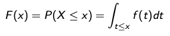
```
]

Es gilt für alle $a<b$:

.center[
```{r eval = TRUE, echo = F, out.width = "550px"}
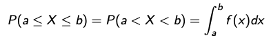
```
]

---
class: top, left
### Stichprobe, Grundgesamtheit - Wahrscheinlichkeitstheorie und Verteilungen

#### Wahrscheinlichkeitsrechnung als Grundlage der Inferenzstatistik

**Erwartungswert**

Beispiel: $X$ ist die erhaltene Augenzahl bei einmaligem Würfeln; die Wahrscheinlichkeitsverteilung von $X$ ist:

.center[
```{r eval = TRUE, echo = F, out.width = "350px"}
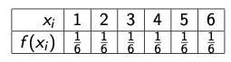
```
]
* Welchen Wert ’erwarten’ wir, wenn wir dieses Zufallsexperiment sehr lange durchführen?

* Intuitiv erwarten wir $X = 1$ bei $\frac{1}{6}$ der Würfe, $X = 2$ bei  $\frac{1}{6}$ bei der Würfe, usw.

* Der Durchschnitt von $X$ auf lange Sicht ist der Erwartungswert von $X$

* Der Erwartungswert einer ZV ist ein Maß für das Zentrum der Verteilung

---
class: top, left
### Stichprobe, Grundgesamtheit - Wahrscheinlichkeitstheorie und Verteilungen

#### Wahrscheinlichkeitsrechnung als Grundlage der Inferenzstatistik

**Varianz der ZV**

Die Varianz $σ^2$ ist ein Streuungsmaß der Verteilung

$$σ_{X}^2 =E[(X−E[X])^2]=E[X^2]−(E[X])^2$$

---
class: top, left
### Stichprobe, Grundgesamtheit - Wahrscheinlichkeitstheorie und Verteilungen

#### Wahrscheinlichkeitsrechnung als Grundlage der Inferenzstatistik

**Varianz der ZV**

Beispiel: $X$ ist die beobachtete Augenzahl bei einmaligem Würfeln; die Wahrscheinlichkeitsverteilung von $X$ ist

.center[
```{r eval = TRUE, echo = F, out.width = "650px"}
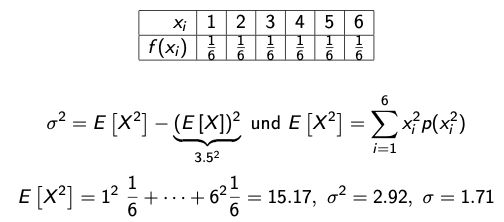
```
]

---
class: top, left
### Stichprobe, Grundgesamtheit - Wahrscheinlichkeitstheorie und Verteilungen

#### Wahrscheinlichkeitsrechnung als Grundlage der Inferenzstatistik

<small>

**α-Quantil**

Als α-Quantil $q_{α}$ wird ein Wert bezeichnet, unterhalb dessen ein vorgegebener Anteil $α$ aller Fälle der Verteilung liegen

* Jeder Wert unterhalb von $q_{α}$ unterschreitet den Anteil $α$, mit $α$ als reelle Zahl zwischen 0 (gar kein Fall der Verteilung) und 1 (alle Fälle oder 100% der Verteilung)

* Für stetige ZV gilt:

.center[
```{r eval = TRUE, echo = F, out.width = "450px"}
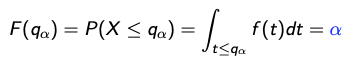
```
]

* Für diskrete ZV gilt (Aufrunden zur nächsten ganzzahligen Ausprägung):

.center[
```{r eval = TRUE, echo = F, out.width = "450px"}
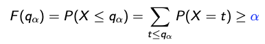
```
]

---
class: top, left
### Stichprobe, Grundgesamtheit - Wahrscheinlichkeitstheorie und Verteilungen

#### Wahrscheinlichkeitsrechnung als Grundlage der Inferenzstatistik

##### Spezielle diskrete Verteilungen

**Diskrete Gleichverteilung**

<small>

* Diese Verteilung beschreibt eine ZV, welche die Zahlen $1,2,··· ,m$ annehmen kann, und es gilt:

.center[
```{r eval = TRUE, echo = F, out.width = "450px"}
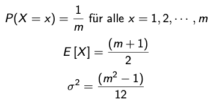
```
]

* Anwendung bei Zufallsexperimenten, deren Ergebnisse gleich häufig sind, also wenn angenommen wird, dass die $m$ Elementarereignisse gleichwahrscheinlich sind

---
class: top, left
### Stichprobe, Grundgesamtheit - Wahrscheinlichkeitstheorie und Verteilungen

#### Wahrscheinlichkeitsrechnung als Grundlage der Inferenzstatistik

##### Spezielle diskrete Verteilungen

**Diskrete Gleichverteilung**

Beispiel: 

X = die erhaltene Augenzahl bei einmaligem Würfeln

.center[
```{r eval = TRUE, echo = F, out.width = "250px"}
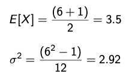
```
]

---
class: top, left
### Stichprobe, Grundgesamtheit - Wahrscheinlichkeitstheorie und Verteilungen

#### Wahrscheinlichkeitsrechnung als Grundlage der Inferenzstatistik

##### Spezielle diskrete Verteilungen

**Diskrete Gleichverteilung**

.center[
```{r echo = F, out.width="350px", out.height="350px"}
require(ggplot2)
require(grid)

x1  <- 3:17
df <- data.frame(x = x1, y = rdunif(1, 1, 1))

plot1 <- ggplot(df, aes(x = x, y = y)) + geom_bar(stat = "identity", col = "black", fill = "black") + 
  scale_y_continuous(expand = c(0.01, 0)) +
  coord_cartesian(ylim = c(0,2)) +
  xlab("1 bis m") + ylab("1/m") + 
  labs(title = "Gleichverteilung") + 
  theme_classic() +
  theme(plot.title = element_text(size = rel(1.2), vjust = 1.5), text = element_text(size = 25), axis.text.y = element_blank())

print(plot1)
```
]

---
class: top, left
### Stichprobe, Grundgesamtheit - Wahrscheinlichkeitstheorie und Verteilungen

#### Wahrscheinlichkeitsrechnung als Grundlage der Inferenzstatistik

##### Spezielle diskrete Verteilungen

**Binomialverteilung**

* Wir betrachten ein Zufallsexperiment mit 2 Ausgängen, ’Erfolg (2)’ und ’Misserfolg (1)’

* Die Wahrscheinlichkeit für Erfolg sei $p$, mit $p$ zwischen 0 und 1

* Wir führen dieses Experiment n-mal durch, wobei zwischen den einzelnen Durchführungen Unabhängigkeit angenommen wird (’Ziehen mit Zurücklegen’)

* Die ZV $X$ beschreibt die Anzahl der Erfolge und ist binomialverteilt mit Parametern $n$ und $p$, $X$ ~ $B(n, p)$

.center[
```{r eval = TRUE, echo = F, out.width = "550px"}
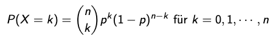
```
]

---
class: top, left
### Stichprobe, Grundgesamtheit - Wahrscheinlichkeitstheorie und Verteilungen

#### Wahrscheinlichkeitsrechnung als Grundlage der Inferenzstatistik

##### Spezielle diskrete Verteilungen

**Binomialverteilung**

.center[
```{r echo = F, out.width="350px", out.height="350px"}
require(ggplot2)
require(grid)

x1  <- 3:17
df <- data.frame(x = x1, y = dbinom(x1, 20, 0.5))

plot1 <- ggplot(df, aes(x = x, y = y)) + geom_bar(stat = "identity", col = "black", fill = "black") + 
  scale_y_continuous(expand = c(0.01, 0)) + xlab("x") + ylab("Dichte") + 
  labs(title = "p = 0.5, n = 20") +
  theme_classic() +
  theme(plot.title = element_text(size = rel(1.2), vjust = 1.5), text = element_text(size = 25))

print(plot1)
```
]

---
class: top, left
### Stichprobe, Grundgesamtheit - Wahrscheinlichkeitstheorie und Verteilungen

#### Wahrscheinlichkeitsrechnung als Grundlage der Inferenzstatistik

##### Spezielle diskrete Verteilungen

**Binomialverteilung**

* Beispiel: Ein Glücksrad besteht aus 20 Feldern, wobei 5 davon Gewinnfelder sind. 

* Wie groß ist die Wahrscheinlichkeit, dass Sie zwei Mal gewinnen, wenn Sie das Glücksrad drei Mal drehen?

* Experiment mit 2 Ausgängen, Erfolg (5 Gewinnfelder) und Misserfolg

* $n = 3$, weil wir das Glücksrad drei Mal drehen

* $p = \frac{5}{20} = 0.25$ ist die Wahrscheinlichkeit zum Erfolg

.center[
```{r eval = TRUE, echo = F, out.width = "550px"}
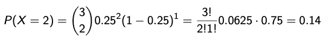
```
]

---
class: top, left
### Stichprobe, Grundgesamtheit - Wahrscheinlichkeitstheorie und Verteilungen

#### Wahrscheinlichkeitsrechnung als Grundlage der Inferenzstatistik

##### Spezielle diskrete Verteilungen

**Binomialverteilung**

<small>

* Binomialverteilte ZV nimmt Werte zwischen 0 und $n$ an

* Binomialverteilung ist symmetrisch für $p = 0.5$

* Je kleiner/größer $p$ desto rechts/links-schiefer die Verteilung

* Summe mehrerer Bernoulli-Variablen

Erwartungswert und Varianz:

$$E[X]=np$$ 

$$σ^2 =np(1−p)$$

* Für $n = 1$: $B(1, p)$ ist eine Bernoulli-ZV mit Erwartungswert $p$ und Varianz $p(1 − p)$

---
class: top, left
### Stichprobe, Grundgesamtheit - Wahrscheinlichkeitstheorie und Verteilungen

#### Wahrscheinlichkeitsrechnung als Grundlage der Inferenzstatistik

##### Spezielle stetige Verteilungen

**Normalverteilung (NV)**

<small>

* Die NV ist eine stetige Verteilung, die durch 2 Parameter $μ$ und $σ$ charakterisiert ist

* Es sei $X$ eine ZV die $N(μ,σ^2)$ verteilt ist; $X$ kann Werte zwischen $−∞$ und $+∞$ annehmen

Dichtefunktion $φ_{(x)}$:

.center[
```{r eval = TRUE, echo = F, out.width = "350px"}
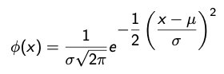
```
]

* Geht $x$ → $±∞$ strebt $φ(x)$ gegen 0

* $φ(x)$ ist symmetrisch um $μ$

---
class: top, left
### Stichprobe, Grundgesamtheit - Wahrscheinlichkeitstheorie und Verteilungen

#### Wahrscheinlichkeitsrechnung als Grundlage der Inferenzstatistik

##### Spezielle stetige Verteilungen

**Normalverteilung (NV)**

* $σ$ gibt den Abstand zwischen $μ$ und den Wendepunkten der Dichtefunktion an

* Wendepunkte an den Stellen $μ±σ$

* Wenn $σ$ groß ist, ist die Verteilung breit und niedrig, wenn $σ$ klein ist, ist die Verteilung schmal und hoch

* Fläche unter $φ(x)$ zwischen $−∞$ und $+∞$ ist gleich 1

* Die Fläche $μ ± σ$ umfasst ca. 68% aller Fälle

* Die Fläche $μ ± 2σ$ umfasst ca. 95% aller Fälle

* Es existieren unendlich viele NV durch beliebige Auswahl von $μ$ und $σ$

---
class: top, left
### Stichprobe, Grundgesamtheit - Wahrscheinlichkeitstheorie und Verteilungen

#### Wahrscheinlichkeitsrechnung als Grundlage der Inferenzstatistik

##### Spezielle stetige Verteilungen

**Normalverteilung (NV)**

.center[
```{r echo=FALSE, out.width="350px", out.height="350px"}
x = rnorm(100, mean = 0, sd = 1)
ggplot(data = data.frame(x = c(-6 * sd(x) + mean(x), 6 * sd(x) + mean(x))), aes(x)) +
  stat_function(fun = dnorm, n = 101, args = list(mean = mean(x), sd = sd(x)+2)) + 
  ylab("φ(x)") +
  xlab("") +
  ggtitle("N(1,3)") +
  scale_x_continuous(breaks = c(mean(x) - (sd(x)+2), mean(x), mean(x) + (sd(x)+2)), labels = c("-σ","μ", "+σ")) +
  scale_y_continuous(breaks = NULL) +
  geom_vline(xintercept = mean(x), linetype = "dashed", colour = "red") +
  geom_vline(xintercept = sd(x) + 2, linetype = "dashed", colour = "red") +
    geom_vline(xintercept = mean(x) - (sd(x)+2), linetype = "dashed", colour = "red") +
  theme_classic() +
  theme(text = element_text(size = 25))
```
]

---
class: top, left
### Stichprobe, Grundgesamtheit - Wahrscheinlichkeitstheorie und Verteilungen

#### Beispiel IQ:

<small>

.pull-left[
* Wir interessieren uns für den Mittelwert $\bar{x}_{IQ}$ und die empirische Varianz $s^2_{empIQ}$ des IQs von Personen in Europa

* Wir setzen voraus, dass das Histogramm der Variable IQ in der Population der Personen in Europa durch die Wahrscheinlichkeitsdichtefunktion einer Normalverteilung approximiert werden kann, d.h. dass das Histogramm die „Form“ der Dichte einer Normalverteilung hat.

* Dies ist eine **Annahme**, von der wir nicht wissen, ob sie zutrifft. Wir werden jedoch Methoden kennenlernen, um die Plausibilität dieser Annahme zu überprüfen.

]

.pull-right[
.center[
```{r echo=FALSE, out.width="450px", out.height="450px"}

df <- data.frame(PF = rnorm(100000, mean = 100, sd = 15))
ggplot(df, aes(x = PF)) + 
    geom_histogram(aes(y =..density..),
                   breaks = seq(50, 150, by = 2), 
                   colour = "black", 
                   fill = "white", bins = 100) +
  scale_x_continuous( breaks = seq(50, 150, by = 50)) +
  stat_function(fun = dnorm, args = list(mean = mean(df$PF), sd = sd(df$PF))) +
  labs(x = "IQ", y = "relative Häufigkeit") +
   theme_classic() +
  theme(text = element_text(size = 25))
```
]
]

---
class: top, left
### Stichprobe, Grundgesamtheit - Wahrscheinlichkeitstheorie und Verteilungen

#### Beispiel IQ:

* Außerdem setzen wir wieder voraus, dass alle Personen die **gleiche Wahrscheinlichkeit** haben, gezogen zu werden.

* Sei nun $X$ eine Zufallsvariable, die für den IQ der zufällig gezogenen Person steht.
* Man kann dann beweisen, dass diese Zufallsvariable $X$ einer Normalverteilung folgt und der Parameter $𝜇$ dieser Normalverteilung dem Mittelwert des IQs in der Population entspricht:
  
$$𝜇 = \bar{x}_{IQ}$$

* der Parameter $𝜎^2$ dieser Normalverteilung der empirischen Varianz des IQs in der Population entspricht:

$$𝜎^2 = s^2_{empIQ}$$

* Der Beweis hierfür funktioniert ähnlich wie bei der Bernoulli-Verteilung, ist aber deutlich aufwendiger.

---
class: top, left
### Stichprobe, Grundgesamtheit - Wahrscheinlichkeitstheorie und Verteilungen

#### Beispiel IQ:

**Zusammengefasst:** Unter der Voraussetzung, dass
* das Histogramm des IQs in der Population der Personen in Deutschland durch die Wahrscheinlichkeitsdichtefunktion einer Normalverteilung approximiert werden kann,

* jede Person in der Population die gleiche Wahrscheinlichkeit hat, gezogen zu werden,

* $X$ eine Zufallsvariable ist, die für den IQ der gezogenen Person steht

folgt $X$ einer Normalverteilung und
  * der Wert des Parameters $𝝁$ dieser Normalverteilung ist identisch mit dem Mittelwert $\bar{x}_{IQ}$ des IQs in der Population,
  * der Wert des Parameters $𝝈^2$ dieser Normalverteilung ist identisch mit der empirischen Varianz $s^2_{empIQ}$ des IQs in der Population.


---
class: top, left
### Stichprobe, Grundgesamtheit - Wahrscheinlichkeitstheorie und Verteilungen

#### Wahrscheinlichkeitsrechnung als Grundlage der Inferenzstatistik

##### Spezielle stetige Verteilungen

**Standardnormalverteilung $N(0,1)$**

* Spezielle NV für $μ = 0$ und $σ = 1$ (Gauß’sche Glockenkurve)

* Verteilung der $N(0,1)$ ist tabelliert

* Fläche zwischen $μ = 0$ und einem beliebigen Wert z ist ablesbar 

* Quantile der NV; 1-Fläche rechts von einem Wert z, und links von −z 

* Ist X $N(μ,σ^2)$ verteilt dann führt die Transformation $\frac{X−μ}{σ}$ auf eine $N(0,1)$ Verteilung

* Vorteil, da Quantile in Tabellen ablesbar (es müssen nicht jedes mal Integrale für Dichtefunktion berechnet werden)

---
class: top, left
### Stichprobe, Grundgesamtheit - Wahrscheinlichkeitstheorie und Verteilungen

#### Wahrscheinlichkeitsrechnung als Grundlage der Inferenzstatistik

##### Spezielle stetige Verteilungen

**Standardnormalverteilung $N(0,1)$**

.center[
```{r echo=FALSE, out.width="350px", out.height="350px"}
x = rnorm(100, mean = 0, sd = 1)
ggplot(data = data.frame(x = c(-3 * sd(x) + mean(x), 3 * sd(x) + mean(x))), aes(x)) +
  stat_function(fun = dnorm, n = 101, args = list(mean = mean(x), sd = sd(x))) + 
  ylab("φ(x)") +
  xlab("") +
  ggtitle("N(0,1)") +
  scale_x_continuous(breaks = c(mean(x) - (sd(x)), mean(x), mean(x) + (sd(x))), labels = c("-1","0", "1")) +
  scale_y_continuous(breaks = NULL) +
  geom_vline(xintercept = mean(x), linetype = "dashed", colour = "red") +
  geom_vline(xintercept = sd(x) , linetype = "dashed", colour = "red") +
    geom_vline(xintercept = mean(x) - (sd(x)), linetype = "dashed", colour = "red") +
  theme_classic() +
  theme(text = element_text(size = 25))
```
]

---
class: top, left
### Stichprobe, Grundgesamtheit - Wahrscheinlichkeitstheorie und Verteilungen

#### Nutzen von Wahrscheinlichkeitsverteilungen zur Quantifizierung des Stichprobenfehlers:

**Z.B. Standardnormalverteilung (N~0,1):**

* Quantile der Standardnormalverteilung sind tabelliert

Z-Tabelle

* Wahrscheinlichkeit für jeden z-Wert kann abgelesen werden

* Zusammensetzen des z-Werts aus Zeile (bis 1 Stelle nach dem Komma) und Spalte (2. Stelle nach dem Komma)

* Anhand der Tabelle kann abgelesen werden, wie wahrscheinlich die Werte einer Verteilung sind (angenommen die Variable ist normalverteilt)

---
class: top, left
### Stichprobe, Grundgesamtheit - Wahrscheinlichkeitstheorie und Verteilungen


```{r echo = F}
z0 <- seq(0, 3, 0.1)
z00 <- seq(0, 0.09, 0.01)
m <- outer(z0, z00, FUN = function(z0, z00) pnorm(z0 + z00))
m <- cbind(z0, m)
colnames(m) <- c("z", format(z00, decimal.mark = ","))
m[,1] = round(m[,1], 2)
m[,2:ncol(m)] = round(m[,2:ncol(m)], 4)
m = as.data.frame(m)
m[,1] = as.character(m[,1])

m[1:20,] %>%
  kbl() %>%
  kable_classic(full_width = T, position = "left", font_size = 10)
```

---
class: top, left
### Stichprobe, Grundgesamtheit - Wahrscheinlichkeitstheorie und Verteilungen

**Standardnormalverteilung (N~0,1):**

Bedeutung der p-Werte

* Die Felder in der Tabelle geben Ihnen die Wahrscheinlichkeit $P$ an, dass genau der ausgewählte z-Wert oder ein kleinerer z-Wert auftritt.

* Die Wahrscheinlichkeit, die Sie in den Feldern der z Tabelle finden, entspricht der Fläche unter der Verteilung.

* Diese  Fläche ist das Integral der Dichtefunktion von $-∞$ bis z.

---
class: top, left
### Stichprobe, Grundgesamtheit - Wahrscheinlichkeitstheorie und Verteilungen

**Standardnormalverteilung (N~0,1):**

**Beispiel: Orientierung in der z-Tabelle**

Aufgabe: Sie suchen den z-Wert 0.35.

**Schritt 1:** Schauen Sie die 1. Spalte an

In der ersten Spalte (senkrecht) finden Sie die ersten zwei Ziffern 0.3 des z-Werts. 

**Schritt 2:** Schauen Sie die 2. Spalte an

Die zweite Nachkommastelle 5 (entspricht 0.05), findet sich in der Spalte 0.05.

**Schritt 3:** Wahrscheinlichkeit finden

Das Feld, in dem sich nun die Zeile mit 0.3 und die Spalte mit 0.05 kreuzen, ist die gesuchte Wahrscheinlichkeit für 0.35 oder einen kleineren z-Wert also $P(X ≤ 0.35) =0.63683$

---
class: top, left
### Stichprobe, Grundgesamtheit - Wahrscheinlichkeitstheorie und Verteilungen

**Standardnormalverteilung (N~0,1):**

Negative Werte in der z-Werte Tabelle:

Wie Sie wahrscheinlich gesehen haben, fängt die z-Tabelle bei 0 an. Was machen Sie also, wenn Ihr gegebener z-Wert negativ ist?

Dafür gibt es einen Trick: Die Standardnormalverteilung ist achsensymmetrisch (die Funktion spiegelt sich also an der y-Achse). Das heißt, sie verläuft links und rechts von der y-Achse genau spiegelverkehrt.

Es gilt: $Φ(−x) = 1−Φ(x)$

Wenn Sie einen negativen z Wert haben, suchen Sie also zunächst den dazugehörigen positiven z-Wert. Dann rechnen Sie 1 minus den positiven z-Wert.

---
class: top, left
### Stichprobe, Grundgesamtheit - Wahrscheinlichkeitstheorie und Verteilungen

**Standardnormalverteilung (N~0,1):**

* Um die Standardnormalverteilung Tabelle nutzen zu können, brauchen Sie entweder einen gegebenen z-Wert oder eine gegebene Wahrscheinlichkeit.

* Die Berechnung eines z-Werts kann für jeden Wert einer normalverteilten Variable erfolgen

* Dieser Prozess nennt sich **z-Transformation** oder kurz **Standardisierung**

* Dafür braucht man nichts weiter als den Mittelwert und die Standardabweichung der Verteilung

$$z_{i} = \frac{x_{i} - \bar{x}}{s}$$

---
class: top, left
### Stichprobe, Grundgesamtheit - Wahrscheinlichkeitstheorie und Verteilungen

**Standardnormalverteilung (N~0,1):**

Vorteil der Standardisierung:

* Messwerte von Personen verschiedener Populationen sind oft nicht direkt **vergleichbar**, z.B. die Leistung eines Mädchens in Kugelstoßen mit jener eines Jungen

* Dennoch möchte man ausdrücken können, wie gut die beiden Leistungen innerhalb der Bezugsgruppe sind

* Der Standardmesswert $z_{i}$: bezieht den beobachteten Messwert $x_{i}$ der i-ten Person auf den Mittelwert $\bar{x}$ der Gruppe und drückt die Abweichung in Standardeinheiten $s$ aus

---
class: top, left
### Stichprobe, Grundgesamtheit - Wahrscheinlichkeitstheorie und Verteilungen

**Standardnormalverteilung (N~0,1):**

Beispiel: Standardisierung Kugelstoßen $(N=5)$; Vergleich Frauen (w) und Männer (m)

.center[
```{r echo = F}
set.seed(123)
N = 5
df = data.frame(ID = paste0(rep(1:N)),
                 Meter_m = round(rnorm(N, 9, 2)),
                Meter_w = round(rnorm(N, 6, 2))
)
x = df$Meter_m
n = length(x)
df2 = df
df = as.data.frame(t(df))
#rownames(df) = NULL
kable(df[,], col.names = NULL)
```
]
.left[Lösungsweg (für 3. Mann):] 

$$\bar{x}=\frac{`r paste(x, collapse = " + ")`}{`r n`}=\frac{`r sum(x)`}{`r n`}=`r round(mean(x), 2)`$$
$$s=\sqrt{\frac{`r paste(paste0("(",x, "-", round(mean(x),2),")^2"), collapse = " + ")`}{`r n`-1}}=\sqrt{\frac{`r sum((x - mean(x))^2)`}{`r n-1`}}=`r round(sd(x), 2)`$$

$$z_{3}=\frac{`r x[3]` - `r round(mean(x), 2)`}{`r round(sd(x), 2)`}= `r round(scale(x)[3], 2)`$$
---
class: top, left
### Stichprobe, Grundgesamtheit - Wahrscheinlichkeitstheorie und Verteilungen

**Standardnormalverteilung (N~0,1):**

Beispiel: Standardisierung Kugelstoßen $(N=5)$; Vergleich Frauen (w) und Männer (m)

.center[
```{r echo = F}
set.seed(123)
N = 5
df = data.frame(ID = paste0(rep(1:N)),
                 Meter_m = round(rnorm(N, 9, 2)),
                Meter_w = round(rnorm(N, 6, 2))
)
x = df$Meter_m
n = length(x)
df2 = df
df = as.data.frame(t(df))
#rownames(df) = NULL
kable(df[,], col.names = NULL)
```

Nach der Standardisierung jeden Werts anhand Mittelwert und Standardabweichung der Referenzgruppe:

```{r echo = F}
set.seed(123)
N = 5
df = data.frame(ID = paste0(rep(1:N)),
                 z_m = round(rnorm(N, 9, 2)),
                z_w = round(rnorm(N, 6, 2))
)
df$z_m = round(scale(df$z_m), 2)
df$z_w = round(scale(df$z_w), 2)
x = df$z_m
n = length(x)
df2 = df
df = as.data.frame(t(df))
#rownames(df) = NULL
kable(df[,], col.names = NULL)
```
]

**Interpretation:** Während z.B. die 2. Frau absolut weniger weit gestoßen hat (7m) als der 2. Mann (9m), liegt sie relativ zum Mittel der Gruppen vor ihm (0.53 > -0.26).

---
class: top, left
### Stichprobe, Grundgesamtheit - Wahrscheinlichkeitstheorie und Verteilungen

#### Nutzen von Wahrscheinlichkeitsverteilungen zur Quantifizierung des Stichprobenfehlers:

**Z.B. Standardnormalverteilung (N~0,1):**

Beispiel 1:

* gegeben sei eine normalverteilte Variable X mit Mittelwert von 11 und Varianz von 5.53

* Wie hoch ist die Wahrscheinlichkeit das X nicht mehr als 14.5 Punkte aufweist?

* Zunächst berechnen wir den z-Wert für $X=14.5$ (siehe Standardisierung)

$$z=\frac{14.5-11}{\sqrt{5.53}}=1.49$$
* In der z-Tabelle schlagen wir nach, wie wahrscheinlich ein z-Wert von höchstens 1.49 ist

$$P(Z \leq 1.49) = 0.9319$$
* Mit einer 93%-igen Wahrscheinlichkeit ist ein zufällig aus der Verteilung gezogener Wert nicht größer als 14.5

---
class: top, left
### Stichprobe, Grundgesamtheit - Wahrscheinlichkeitstheorie und Verteilungen

#### Nutzen von Wahrscheinlichkeitsverteilungen zur Quantifizierung des Stichprobenfehlers:

**Z.B. Standardnormalverteilung (N~0,1):**

Beispiel 2:

* gegeben sei eine normalverteilte Variable X mit Mittelwert von 11 und Varianz von 5.53

* Wie hoch ist die Wahrscheinlichkeit, dass X mehr als 14.5 Punkte aufweist?

* Zunächst berechnen wir den z-Wert für $X=14.5$ (siehe Standardisierung)

$$z=\frac{14.5-11}{\sqrt{5.53}}=1.49$$
* In der z-Tabelle schlagen wir nach, wie wahrscheinlich ein z-Wert von größer als 1.49 ist

$$P(Z > 1.49) = 1- P(Z \leq 1.49)= 1-0.9319=0.0681$$
* Mit einer 6.8%-igen Wahrscheinlichkeit ist ein zufällig aus der Verteilung gezogener Wert größer als 14.5.


---
class: top, left
### Take-aways

.full-width[.content-box-gray[
* **Inferenzstatistik** ist ein wahrscheinlichkeitsbasierter Schluss von Zufallsstichprobe auf Population

* Variablen in der Population sind nicht vollständig beobachtbar und daher **Zufallsvariablen** (diskret vs. stetig)

* **Wahrscheinlichkeitsfunktion** definiert welche Werte wir beim zufälligen Ziehen mit welcher Wahrscheinlichkeit erwarten

* Der **Erwartungswert** ist das Zentrum der Verteilung und der wahrscheinlichste Wert 

* Unter der **Gleichverteilung** ist jedes Ereignis gleich wahrscheinlich

* **Binomialverteilung** lässt uns Wahrscheinlichkeit für ein diskretes Ereignis mit 2 Ausgängen berechnen

* **Normalverteilung** ist stetige Verteilung, die extremen Ereignissen geringere und durchschnittlichen Ereignissen höhere Wahrscheinlichkeit zuweist 
]
]

