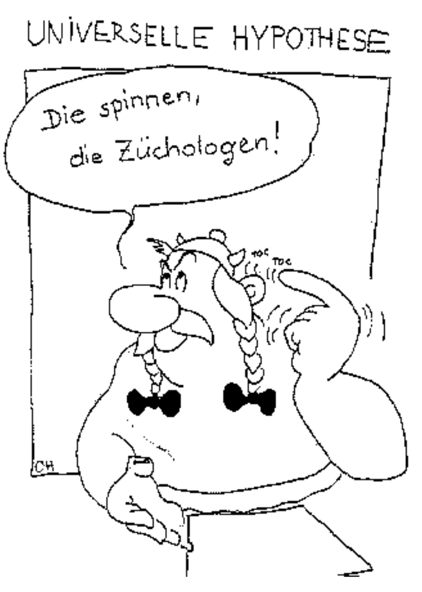
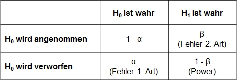
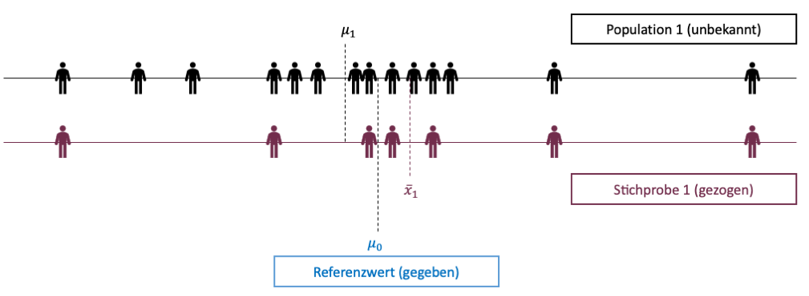

```{r setup, include=FALSE}
options(htmltools.dir.version = FALSE)

htmltools::tagList(rmarkdown::html_dependency_jquery())

library(tidyverse)
library(kableExtra)
library(ggplot2)
library(plotly)
library(htmlwidgets)
library(MASS)
library(ggpubr)
library(xaringanthemer)
library(xaringanExtra)
library(gghighlight)

style_duo_accent(
  primary_color = "#621C37",
  secondary_color = "#EE0071",
  background_image = "blank.png"
)

xaringanExtra::use_xaringan_extra(c("tile_view"))

use_scribble(
  pen_color = "#EE0071",
  pen_size = 4
)

knitr::opts_chunk$set(
  fig.retina = TRUE,
  warning = FALSE,
  message = FALSE
)
```

name: Title slide
class: middle, left
<br><br><br><br><br><br><br>
# Statistik I
***
### Einheit 7: Hypothesen und Hypothesentests
##### Sommersemester 2026 | Prof. Dr. Stephan Goerigk

---
class: top, left
### Hypothesen und Hypothesentests

#### Wiederholung:

**Inferenzstatistik: **

* Umfasst alle statistischen Verfahren, die es erlauben, trotz der Informationsunvollständigkeit der Stichprobendaten Aussagen über eine Population zu treffen.

* Wir wissen nun, dass wir einzelne Populationsparameter aus der Stichprobe schätzen können

ABER: 

* Das reine Schätzen eines Wertes ist noch keine wissenschaftliche Aussage

* Was für "Aussagen", die wir über die Population treffen, sind gemeint?


---
class: top, left
### Hypothesen und Hypothesentests

#### Was sind Hypothesen?

Hypothese (griech.) = Unterstellung, Vermutung

Eine Vermutung/Annahme ist dann als wissenschaftliche Hypothese zu verstehen, wenn sie folgende 5 Kriterien erfüllt:

Wenn sie...
1. ...sich auf reale Sachverhalte bezieht, die empirisch untersuchbar sind. (**Empirie**)

2. ...allgemein gültig ist und über den Einzelfall bzw. ein singuläres Ereignis hinausgeht. (**All-Satz**)

3. ...zumindest implizit die Form eines Konditionalsatzes hat. (**wenn-dann, je-desto**)

4. ...durch Erfahrungen potenziell widerlegbar ist. (**Falsifizierbarkeit**)

5. ...(theoretisch begründbar ist)

---
class: top, left
### Hypothesen und Hypothesentests

.pull-left[
#### Beispiele für Hypothesen:

* Frauen sind kreativer als Männer

* Mit zunehmender Müdigkeit sinkt die Konzentrationsfähigkeit

* Je schöner das Wetter, desto besser die Stimmung

* Jungen und Mädchen lesen unterschiedlich viel in ihrer Freizeit

Behauptungen erfüllen alle genannten Kriterien: sind daher Hypothesen
]

.pull-right[
```{r eval = TRUE, echo = F, out.width = "300px"}

```
]

---
class: top, left
### Hypothesen und Hypothesentests

#### Hypothesen: JA oder NEIN?

* Bei starkem Zigarettenkonsum kann es zu Herzinfarkt kommen

* Wenn es regnet, kann die Sonne scheinen.

* Es gibt Kinder, die niemals weinen.

* SchülerInnen aus Gymnasien zeigen gute Leistungen

---
class: top, left
### Hypothesen und Hypothesentests

#### Hypothesen: JA oder NEIN?

* Bei starkem Zigarettenkonsum kann es zu Herzinfarkt kommen

$\rightarrow$ Kann-Sätze sind nicht falsifizierbar

* Wenn es regnet, kann die Sonne scheinen.

$\rightarrow$ Kann-Sätze sind nicht falsifizierbar

* Es gibt Kinder, die niemals weinen.

$\rightarrow$ kein All-Satz, nicht falsifizierbar

* Schüler:innen aus Gymnasien zeigen gute Leistungen

$\rightarrow$ Wenn-dann Struktur nicht gegeben, daher nicht
falsifizierbar

---
class: top, left
### Hypothesen und Hypothesentests

#### Hypothesen: JA oder NEIN?

* Die Konzentrationsfähigkeit hängt mit der Blutalkoholkonzentration zusammen.

* Positive Verstärkung durch Lehrer:innen kann zu guten Leistungen bei Schüler:innen führen.

* Positives Feedback beeinflusst die Arbeitsleistung.

* Viele Studierende mögen Methodenlehrveranstaltungen.

---
class: top, left
### Hypothesen und Hypothesentests

#### Hypothesen: JA oder NEIN?

* Die Konzentrationsfähigkeit hängt mit der Blutalkoholkonzentration zusammen.

$\rightarrow$ JA

* Positive Verstärkung durch Lehrer:innen kann zu guten Leistungen bei Schüler:innen führen.

$\rightarrow$ NEIN

* Positives Feedback beeinflusst die Arbeitsleistung.

$\rightarrow$ JA

* Viele Studierende mögen Methodenlehrveranstaltungen.

$\rightarrow$ NEIN

---
class: top, left
### Hypothesen und Hypothesentests

#### Richtung von Hypothesen

Je nach Erkenntnisstand kann eine ungerichtete oder eine gerichtete Hypothese formuliert werden.

**Ungerichtete Hypothese:**

Die Konzentrationsfähigkeit hängt mit der Blutalkoholkonzentration zusammen.

$\rightarrow$ Eher wenig theoretisches Vorwissen.

**Gerichtete Hypothese:**

Je höher die Blutalkoholkonzentration, desto niedriger die Konzentrationsfähigkeit.

$\rightarrow$ Mehr theoretisches Vorwissen notwendig.

---
class: top, left
###  Hypothesen und Hypothesentests

#### Ableitung von statistisch-prüfbaren Hypothesen aus wiss. Hypothese

* Die Hypothese muss in numerische Ausdrücke umgewandelt werden.

* Man spricht von einem **Hypothesenpaar:**

  * **Nullhypothese $(H_0)$:** Der hypothetisierte Effekt besteht nicht.

  * **Alternativhypothese $(H_1)$:** Der hypothetisierte Effekt besteht

* In der Forschung hofft man oft, dass die $H_1$ zutrifft (Hier steckt der angenommene Effekt drin)

* Man versucht, **"Die $H_0$ zu verwerfen"** (Hypothesentest kommt später)

---
class: top, left
###  Hypothesen und Hypothesentests

#### Ableitung von statistisch-prüfbaren Hypothesen aus wiss. Hypothese

Beispiel: **(Ungerichtete) Forschungshypothese:**

"Männer und Frauen sind im Schnitt unterschiedlich groß."

* ** $H_0$ ** Es besteht **kein Unterschied** zwischen der durchschnittlichen Größe der Männer (Mittelwert) und der durchschnittlichen Größe der Frauen.

* ** $H_1$ ** Es besteht **ein Unterschied** zwischen der durchschnittlichen Größe der Männer (Mittelwert) und der durchschnittlichen Größe der Frauen.

**Ableitung statistische Hypothese:**

* ** $H_0$ ** Mittelwert Männer - Mittelwert Frauen $=$ 0

$\rightarrow$ **In Zahlen:** Wenn kein Unterschied besteht ist Differenz  = 0  (z.B. 10 - 10 = 0)

* ** $H_1$ ** Mittelwert Männer - Mittelwert Frauen $\neq$ 0

$\rightarrow$ **In Zahlen:** Wenn ein Unterschied besteht ist Differenz $\neq$  0 (z.B. 15 - 10 = 5)

---
class: top, left
### Hypothesen und Hypothesentests

#### Beispiele:

* Binomialtest: Auftretenshäufigkeit $\rightarrow$ 1. Semester

* $\chi^2$-Test: Unterschiede in Verteilungen $\rightarrow$ 1. Semester

* unabhängiger t-Test: Unterschiede in Gruppenmittelwerten $\rightarrow$ 1. Semester

* abhängiger t-Test: Unterschiede in Mittelwerten zwischen Zeitpunkten $\rightarrow$ 1. Semester

* Korrelation: Zusammenhänge $\rightarrow$ 1. Semester

* F-Test (ANOVA): Unterschiede in Varianzen $\rightarrow$ 2. Semester

* Regression: Vorhersagen $\rightarrow$ 2. Semester

---
class: top, left
### Hypothesen und Hypothesentests

#### Hypothesen

* Statistisch zu prüfende Aussagen: Hypothesen

* Der Inhalt einer Hypothese muss quantifiziert werden, damit wir sie prüfen können

* Hypothese wird in eine prüfbare Gleichung (oder Ungleichung $\rightarrow$ größer-kleiner Verhältnisse) umgewandelt
  * inhaltlich: Männer sind im Durchschnitt größer als 173 cm
  * numerisch: $𝜇> 173$
  
* Die Entscheidung über die Gültigkeit der Hypothese erfolgt auf Basis unserer Wahrscheinlichkeitsverteilungen ("wie wahrscheinlich ist es, dass...")
  * "Wie wahrscheinlich ist es, dass unter Annahme, dass die Körpergröße normalverteilt ist, der erwartete Mittelwert der Männer größer ist als 173 cm."

* Trifft eine Hypothese zu spricht man oft vom Vorliegen eines **Effekts**


---
class: top, left
### Hypothesen und Hypothesentests

#### Hypothesentest - To-Do Liste

Zur erfolgreichen Durchführung eines Hypothesentests müssen folgende wichtige Schritte geschehen

1. Austellen von Nullhypothese und Alternativhypothese (Hypothesenpaar)

2. Bestimmung einer zugrundeliegenden Verteilung

3. Festlegung des Annahme- und Ablehnungsbereichs der Nullhypothese (kritischer Wert)

4. Beobachtungswert auf Wahrscheinlichkeitsverteilung abbilden
  * Binomialverteilung $\rightarrow$ Wahrscheinlichkeiten
  * z-Verteilung $\rightarrow$ Mittelwerte, wenn $\sigma$ in Population bekannt
  * t-Verteilung $\rightarrow$ Mittelwerte, wenn $\sigma$ in Population nicht bekannt
  * F-Verteilung $\rightarrow$ Varianzen
  * $\chi^2$-Verteilung $\rightarrow$ Häufigkeiten/Proportionen

5. Vergleich kritischer Wert und Teststatistik

6. Entscheidung: Test signifikant oder nicht signifikant

---
class: top, left
### Hypothesen und Hypothesentests

#### Hypothesen

Statistische Hypothese:

* Entscheidung basiert darauf, ob sich ein beobachteter Wert überzufällig stark von einem vorgegebenen Wert unterscheidet

* Das heißt einfach, dass man überprüft, ob die Abweichung des beobachteten Wertes vom hypothetisierten Wert zu groß ist, als dass sie noch zufällig sein kann.

* Um alle Wahrscheinlichkeiten für einen Ausgang des Hypothesentests abzudecken formuliert man ein Hypothesenpaar

  * $H_{0}$: Der hypothetisierte Effekt liegt nicht vor (Werte unterscheiden sich nicht)
  
  * $H_{1}$: Der hypothetisierte Effekt liegt vor (Werte unterscheiden sich)

---
class: top, left
### Hypothesen und Hypothesentests

#### Nullhypothese und Alternativhypothese

Nullhypothese $(H_{0})$:

* Gegenstück zur eigentlichen Untersuchungshypothese, der Alternativhypothese

* Die $H_{0}$ stellt meistens den aktuellen Zustand oder anders ausgedrückt den „Standard“ dar gegen den getestet wird 

Alternativhypothese $(H_{1})$: 

* Die Alternativhypothese beinhaltet oft die neue Annahme, den "Effekt". 

* Drückt eine "Unterschiedlichkeit" von einem Referenzwert aus

$\rightarrow$ Nur über das komplementäre Hypothesenpaar lässt sich eine komplementäre Gesamtwahrscheinlichkeit abdecken:

$$P_{H_{0}} + P_{H_{1}}=1$$


---
class: top, left
### Hypothesen und Hypothesentests

#### Signifikanzniveau

* Um das Ausmaß der Abweichung zu definieren, welches uns als strengen Wissenschaftler:innen ausreichend "sicher" erscheint (kritischer Wert) legen wir eine **"Irrtumswahrscheinlichkeit"** fest

* Diese bezeichnet man als **Signifikanzniveau**  $\alpha$.

* Meistens wird $\alpha=.05$ gewählt (häufige Konvention aus der Wissenschaft)

* Das bedeutet, dass wir eine 5% Wahrscheinlichkeit erlauben unsere Hypothese fälschlicherweise anzunehmen

* Die 5% legen einen bestimmten Bereich auf der Wahrscheinlichkeitsverteilung fest (**Verwerfungsbereich**)
  * z-Verteilung
  * t-Verteilung
  * ...

---
class: top, left
### Hypothesen und Hypothesentests

#### Signifikanzniveau und Verwerfungsbereich

.pull-left[
.center[
```{r echo = F, out.width="400px"}
ggplot(data.frame(x = c(-4, 4)), aes(x)) +
    stat_function(fun = dnorm, geom = "area", fill = "#fdeef5", color = "#621C37") +
    stat_function(fun = dnorm,geom = "area", fill = "#EE0071", xlim = c(-4, qnorm(.05))) +
  labs(x = "", y = "") +
  annotate(geom = "text", x = -2.5, y = 0.05, label = "5%", size = 6) +
    annotate(geom = "text", x = 0, y = .2, label = "H0\n(95%)", size = 6) +
  ggtitle("Verwerfungsbereich:") +
   theme_classic() +
  theme(text = element_text(size = 25), axis.text.y = element_blank(), axis.ticks.y = element_blank())   
```
]
]

.pull-right[
* Die große (rosane) Fläche der Verteilung entspricht der Annahme unserer $H_0$ 

* Der Erwartungswert ist 0 (kein Effekt $\rightarrow$ daher Null-Hypothese)

* Werte jenseits des "kritischen Werts" sind im **Verwerfungsbereich** der $H_0$ (pink).

* Diese sind unter Annahme der $H_0$ ausreichend unwahrscheinlich.

* Wir glauben nicht mehr an einen Zufall!

* Die $H_0$ wird verworfen.

]
---
class: top, left
### Hypothesen und Hypothesentests

#### p-Wert

* In Statistik-Softwareprodukten wird zusammen mit der Teststatistik eines statistischen Tests ein sogenannter **p-Wert** ausgegeben

* Der p-Wert gibt die **Wahrscheinlichkeit für den Fehler erster Art** an, also die Wahrscheinlichkeit, eine gültige $H_{0}$ zu verwerfen aufgrund der beobachteten Daten

* **Vorteil** des p-Wertes liegt darin, dass bei der Entscheidung keine Tabelle der Verteilung der Teststatistik benötigt wird

* Wird der zweiseitige p-Wert angegeben und die $H_{1}$ ist gerichtet, muss man den p-Wert **durch 2 dividieren** und mit $α$ vergleichen.

* Bei einseitigen Hypothesen ist die zusätzliche Überprüfung notwendig, ob die Teststatistik tatsächlich im Verwerfungsbereich der $H_{0}$ liegt

---
class: top, left
### Hypothesen und Hypothesentests

#### Fehler beim Hypothesentest

* Beim Treffen von Entscheidungen können Menschen nicht nur in ganz alltäglichen Situationen Fehler unterlaufen

* Konkret gibt es bei Hypothesentests **vier Möglichkeiten**, wie die Entscheidung ausfallen kann

  * Fehler 1. Art bzw. $\alpha$-Fehler: Wenn die Nullhypothese fälschlicherweise verworfen wird und die Alternativhypothese angenommen wird
  * Fehler 2. Art bzw. $\beta$-Fehler: Wenn die Nullhypothese fälschlicherweise beibehalten wird, obwohl die Alternativhypothese wahr ist 
.center[
```{r eval = TRUE, echo = F, out.width = "550px"}

```
]

---
class: top, left
### Hypothesen und Hypothesentests

#### Fehler beim Hypothesentest

* Die Wahrscheinlichkeit, einen Fehler 1. Art zu begehen, entspricht immer maximal dem Signifikanzniveau

* Je kleiner $α$, umso kleiner der Fehler 1. Art $(H_{0}$ irrtümlich zu verwerfen)

* → $α$ möglichst klein wählen, z.B. $α = 0.001$?

* Entscheiden für Signifikanzniveau ist vergleichbar mit dem Abschluss einer Versicherung. Umso besser der Versicherungsschutz gegen einen $α$-Fehler, umso höher die Kosten.

Kosten eines kleinen (strengen) Signifikanzniveaus:
* Größerer Fehler 2. Art $(β$-Fehler = $H_{0}$ irrtümlich beizubehalten)  
* geringere Teststärke $1 − β$ (Macht oder Power = Wahrscheinlichkeit, $H_{0}$ zugunsten einer $H_{1}$ zu verwerfen, wenn tatsächlich $H_{1}$ gilt)

---
class: top, left
### Hypothesen und Hypothesentests

#### Beziehungen zwischen Statistischen Fehlern

**Dilemma**

* Versicherung gegen $α$-Fehler hat die Kosten eines höheren $β$-Fehlers und geringerer Macht des Tests

* Versicherung gegen $β$-Fehler hat die Kosten eines höheren $α$-Fehlers

* Kompromiss in der Praxis: $α =.05$ oder  $α = .01$ je nachdem, welchen Fehler man eher riskieren möchte

---
class: top, left
### Hypothesen und Hypothesentests

#### Ein- und Zweiseitige Hypothesen

**Einseitige Hypothese:**

* Der beobachtete Wert ist größer oder kleiner als ein Referenzwert 
* Man spricht von einer gerichteten Hypothese
* Beispiel Hypothesenpaar (inhaltlich):
  * $H_{0}$: Männer sind durchschnittlich 173 cm groß oder kleiner
  * $H_{1}$: Männer sind durchschnittlich größer als 173 cm

**Zweiseitige Hypothese:**

* Der beobachtete Wert unterscheidet sich von dem Referenzwert 
* Man spricht von einer ungerichteten Hypothese
* Beispiel Hypothesenpaar (inhaltlich):
  * $H_{0}$: Die Durchschnittsgröße von Männern liegt bei etwa 173 cm
  * $H_{1}$: Die Durchschnittsgröße von Männern unterscheidet sich von 173 cm

---
class: top, left
### Hypothesen und Hypothesentests

#### Ein- und Zweiseitige Hypothesen

**Einseitige Hypothese:**

* Der beobachtete Wert ist größer oder kleiner als ein Referenzwert 
* Man spricht von einer gerichteten Hypothese
* Beispiel Hypothesenpaar (statistisch):
  * $H_{0}$: $𝜇\leq 173$ cm
  * $H_{1}$: $𝜇> 173$ cm

**Zweiseitige Hypothese:**

* Der beobachtete Wert unterscheidet sich von dem Referenzwert
* Man spricht von einer ungerichteten Hypothese
* Beispiel Hypothesenpaar (statistisch):
  * $H_{0}$: $𝜇= 173$ cm
  * $H_{1}$: $𝜇\neq 173$ cm

---
class: top, left
### Hypothesen und Hypothesentests

#### Ein- und Zweiseitige Hypothesen - Graphisch

<svg width="100%" viewBox="0 0 900 345" style="display:block; margin-top:4px;">

  <!-- === COLUMN HEADER BACKGROUNDS === -->
  <rect x="0" y="0" width="300" height="30" fill="#621C37"/>
  <rect x="301" y="0" width="298" height="30" fill="#621C37"/>
  <rect x="601" y="0" width="299" height="30" fill="#621C37"/>
  <!-- === COLUMN HEADER TEXT === -->
  <text x="150" y="21" text-anchor="middle" fill="white" font-size="14" font-weight="700" font-family="inherit">zweiseitig</text>
  <text x="450" y="21" text-anchor="middle" fill="white" font-size="14" font-weight="700" font-family="inherit">linksseitig</text>
  <text x="750" y="21" text-anchor="middle" fill="white" font-size="14" font-weight="700" font-family="inherit">rechtsseitig</text>

  <!-- === H₀ DECISION LABELS === -->
  <!-- Col 1: left reject | center accept | right reject -->
  <text x="53"  y="42" text-anchor="middle" fill="#444" font-size="9" font-family="inherit">H₀</text>
  <text x="53"  y="54" text-anchor="middle" fill="#444" font-size="9" font-family="inherit">ablehnen</text>
  <text x="150" y="42" text-anchor="middle" fill="#444" font-size="9" font-family="inherit">H₀ nicht</text>
  <text x="150" y="54" text-anchor="middle" fill="#444" font-size="9" font-family="inherit">ablehnen</text>
  <text x="247" y="42" text-anchor="middle" fill="#444" font-size="9" font-family="inherit">H₀</text>
  <text x="247" y="54" text-anchor="middle" fill="#444" font-size="9" font-family="inherit">ablehnen</text>
  <!-- Col 2: left reject | right accept -->
  <text x="353" y="42" text-anchor="middle" fill="#444" font-size="9" font-family="inherit">H₀</text>
  <text x="353" y="54" text-anchor="middle" fill="#444" font-size="9" font-family="inherit">ablehnen</text>
  <text x="452" y="48" text-anchor="middle" fill="#444" font-size="9" font-family="inherit">H₀ nicht ablehnen</text>
  <!-- Col 3: left accept | right reject -->
  <text x="748" y="48" text-anchor="middle" fill="#444" font-size="9" font-family="inherit">H₀ nicht ablehnen</text>
  <text x="847" y="42" text-anchor="middle" fill="#444" font-size="9" font-family="inherit">H₀</text>
  <text x="847" y="54" text-anchor="middle" fill="#444" font-size="9" font-family="inherit">ablehnen</text>

  <!-- === BELL CURVES: LIGHT FILL (drawn first) === -->
  <path d="M 44,182 C 56,181 76,173 94,155 C 114,135 136,68 150,68 C 164,68 186,135 206,155 C 224,173 244,181 256,182 Z"
        fill="#fdeef5" stroke="none"/>
  <path d="M 344,182 C 356,181 376,173 394,155 C 414,135 436,68 450,68 C 464,68 486,135 506,155 C 524,173 544,181 556,182 Z"
        fill="#fdeef5" stroke="none"/>
  <path d="M 644,182 C 656,181 676,173 694,155 C 714,135 736,68 750,68 C 764,68 786,135 806,155 C 824,173 844,181 856,182 Z"
        fill="#fdeef5" stroke="none"/>

  <!-- === REJECTION REGION FILLS === -->
  <!-- Zweiseitig: left tail (x=44–82) -->
  <path d="M 44,182 C 54,181 67,176 82,167 L 82,182 Z" fill="#EE0071" opacity="0.35"/>
  <!-- Zweiseitig: right tail (x=218–256) -->
  <path d="M 218,182 L 218,167 C 232,176 246,181 256,182 Z" fill="#EE0071" opacity="0.35"/>
  <!-- Linksseitig: left tail (x=344–382) -->
  <path d="M 344,182 C 354,181 367,176 382,162 L 382,182 Z" fill="#EE0071" opacity="0.35"/>
  <!-- Rechtsseitig: right tail (x=818–856) -->
  <path d="M 818,182 L 818,162 C 832,176 844,181 856,182 Z" fill="#EE0071" opacity="0.35"/>

  <!-- === BELL CURVE OUTLINES === -->
  <path d="M 44,182 C 56,181 76,173 94,155 C 114,135 136,68 150,68 C 164,68 186,135 206,155 C 224,173 244,181 256,182"
        fill="none" stroke="#621C37" stroke-width="2"/>
  <path d="M 344,182 C 356,181 376,173 394,155 C 414,135 436,68 450,68 C 464,68 486,135 506,155 C 524,173 544,181 556,182"
        fill="none" stroke="#621C37" stroke-width="2"/>
  <path d="M 644,182 C 656,181 676,173 694,155 C 714,135 736,68 750,68 C 764,68 786,135 806,155 C 824,173 844,181 856,182"
        fill="none" stroke="#621C37" stroke-width="2"/>

  <!-- === CRITICAL VALUE DASHED LINES === -->
  <line x1="82"  y1="32" x2="82"  y2="188" stroke="#621C37" stroke-width="1.2" stroke-dasharray="4 3"/>
  <line x1="218" y1="32" x2="218" y2="188" stroke="#621C37" stroke-width="1.2" stroke-dasharray="4 3"/>
  <line x1="382" y1="32" x2="382" y2="188" stroke="#621C37" stroke-width="1.2" stroke-dasharray="4 3"/>
  <line x1="818" y1="32" x2="818" y2="188" stroke="#621C37" stroke-width="1.2" stroke-dasharray="4 3"/>

  <!-- === α LABELS === -->
  <text x="61"  y="165" text-anchor="middle" fill="#621C37" font-size="11" font-weight="600" font-family="inherit">α/2</text>
  <text x="239" y="165" text-anchor="middle" fill="#621C37" font-size="11" font-weight="600" font-family="inherit">α/2</text>
  <text x="361" y="165" text-anchor="middle" fill="#621C37" font-size="11" font-weight="600" font-family="inherit">α</text>
  <text x="839" y="165" text-anchor="middle" fill="#621C37" font-size="11" font-weight="600" font-family="inherit">α</text>

  <!-- === AXIS LINES === -->
  <line x1="44"  y1="183" x2="256" y2="183" stroke="#888" stroke-width="1"/>
  <line x1="344" y1="183" x2="556" y2="183" stroke="#888" stroke-width="1"/>
  <line x1="644" y1="183" x2="856" y2="183" stroke="#888" stroke-width="1"/>

  <!-- === AXIS TICKS === -->
  <line x1="82"  y1="181" x2="82"  y2="187" stroke="#621C37" stroke-width="1.2"/>
  <line x1="150" y1="181" x2="150" y2="187" stroke="#888"    stroke-width="1"/>
  <line x1="218" y1="181" x2="218" y2="187" stroke="#621C37" stroke-width="1.2"/>
  <line x1="382" y1="181" x2="382" y2="187" stroke="#621C37" stroke-width="1.2"/>
  <line x1="450" y1="181" x2="450" y2="187" stroke="#888"    stroke-width="1"/>
  <line x1="750" y1="181" x2="750" y2="187" stroke="#888"    stroke-width="1"/>
  <line x1="818" y1="181" x2="818" y2="187" stroke="#621C37" stroke-width="1.2"/>

  <!-- === AXIS LABELS === -->
  <text x="82"  y="200" text-anchor="middle" fill="#621C37" font-size="10" font-family="inherit">−t<tspan dy="3" font-size="8">α/2</tspan></text>
  <text x="150" y="200" text-anchor="middle" fill="#888"    font-size="10" font-family="inherit">0</text>
  <text x="218" y="200" text-anchor="middle" fill="#621C37" font-size="10" font-family="inherit">t<tspan dy="3" font-size="8">α/2</tspan></text>
  <text x="382" y="200" text-anchor="middle" fill="#621C37" font-size="10" font-family="inherit">−t<tspan dy="3" font-size="8">α</tspan></text>
  <text x="450" y="200" text-anchor="middle" fill="#888"    font-size="10" font-family="inherit">0</text>
  <text x="750" y="200" text-anchor="middle" fill="#888"    font-size="10" font-family="inherit">0</text>
  <text x="818" y="200" text-anchor="middle" fill="#621C37" font-size="10" font-family="inherit">t<tspan dy="3" font-size="8">α</tspan></text>

  <!-- === COLUMN DIVIDERS === -->
  <line x1="300" y1="0" x2="300" y2="308" stroke="#ccc" stroke-width="1"/>
  <line x1="600" y1="0" x2="600" y2="308" stroke="#ccc" stroke-width="1"/>

  <!-- === TABLE SECTION === -->
  <line x1="0" y1="205" x2="900" y2="205" stroke="#ccc" stroke-width="1"/>
  <!-- Sub-column header background -->
  <rect x="0" y="205" width="900" height="22" fill="#f5f5f3"/>
  <!-- Sub-column dividers -->
  <line x1="140" y1="205" x2="140" y2="308" stroke="#ddd" stroke-width="1"/>
  <line x1="440" y1="205" x2="440" y2="308" stroke="#ddd" stroke-width="1"/>
  <line x1="740" y1="205" x2="740" y2="308" stroke="#ddd" stroke-width="1"/>
  <!-- Sub-column header text -->
  <text x="70"  y="220" text-anchor="middle" fill="#621C37" font-size="10" font-weight="600" font-family="inherit">Ein-Stichproben</text>
  <text x="220" y="220" text-anchor="middle" fill="#621C37" font-size="10" font-weight="600" font-family="inherit">(un-)abhängig</text>
  <text x="370" y="220" text-anchor="middle" fill="#621C37" font-size="10" font-weight="600" font-family="inherit">Ein-Stichproben</text>
  <text x="520" y="220" text-anchor="middle" fill="#621C37" font-size="10" font-weight="600" font-family="inherit">(un-)abhängig</text>
  <text x="670" y="220" text-anchor="middle" fill="#621C37" font-size="10" font-weight="600" font-family="inherit">Ein-Stichproben</text>
  <text x="820" y="220" text-anchor="middle" fill="#621C37" font-size="10" font-weight="600" font-family="inherit">(un-)abhängig</text>
  <!-- Sub-header bottom separator -->
  <line x1="0" y1="227" x2="900" y2="227" stroke="#ccc" stroke-width="1"/>

  <!-- === H₀ FORMULAS === -->
  <text x="8"   y="244" fill="#444" font-size="10" font-family="inherit">H₀: μ = μ₀</text>
  <text x="148" y="244" fill="#444" font-size="10" font-family="inherit">H₀: μ₁ − μ₂ = 0  <tspan fill="#bbb">μ₁ = μ₂</tspan></text>
  <text x="308" y="244" fill="#444" font-size="10" font-family="inherit">H₀: μ ≥ μ₀</text>
  <text x="448" y="244" fill="#444" font-size="10" font-family="inherit">H₀: μ₁ − μ₂ ≥ 0</text>
  <text x="608" y="244" fill="#444" font-size="10" font-family="inherit">H₀: μ ≤ μ₀</text>
  <text x="748" y="244" fill="#444" font-size="10" font-family="inherit">H₀: μ₁ − μ₂ ≤ 0</text>

  <!-- H₀/H₁ row separator -->
  <line x1="0" y1="258" x2="900" y2="258" stroke="#eee" stroke-width="1"/>

  <!-- === H₁ FORMULAS === -->
  <text x="8"   y="275" fill="#444" font-size="10" font-family="inherit">H₁: μ ≠ μ₀</text>
  <text x="148" y="275" fill="#444" font-size="10" font-family="inherit">H₁: μ₁ − μ₂ ≠ 0  <tspan fill="#bbb">μ₁ ≠ μ₂</tspan></text>
  <text x="308" y="275" fill="#444" font-size="10" font-family="inherit">H₁: μ &lt; μ₀</text>
  <text x="448" y="275" fill="#444" font-size="10" font-family="inherit">H₁: μ₁ − μ₂ &lt; 0</text>
  <text x="608" y="275" fill="#444" font-size="10" font-family="inherit">H₁: μ &gt; μ₀</text>
  <text x="748" y="275" fill="#444" font-size="10" font-family="inherit">H₁: μ₁ − μ₂ &gt; 0</text>

  <!-- Table outer border -->
  <rect x="0" y="205" width="900" height="98" fill="none" stroke="#ccc" stroke-width="1"/>

  <!-- === FOOTER === -->
  <line x1="0" y1="308" x2="900" y2="308" stroke="#ddd" stroke-width="1"/>
  <rect x="4" y="316" width="8" height="8" fill="#621C37"/>
  <text x="18" y="324" fill="#555" font-size="9.5" font-family="inherit">μ₀ ist ein Wert gegen welchen wir testen (beispielsweise ein Referenzwert)</text>
  <rect x="4" y="330" width="8" height="8" fill="#621C37"/>
  <text x="18" y="338" fill="#555" font-size="9.5" font-family="inherit">alternative Schreibweisen sind in grau geschrieben</text>

</svg>

---
class: top, left
### Hypothesen und Hypothesentests

#### Ein- und Zweiseitige Hypothesen - Graphisch

.pull-left[
.center[
```{r echo = F, out.width="400px"}
ggplot(data.frame(x = c(-4, 4)), aes(x)) +
    stat_function(fun = dnorm, geom = "area", fill = "#fdeef5", color = "#621C37") +
    stat_function(fun = dnorm,geom = "area", fill = "#EE0071", xlim = c(qnorm(.975), 4)) +
  stat_function(fun = dnorm,geom = "area", fill = "#EE0071", xlim = c(-4, qnorm(.025))) +
  labs(x = "", y = "") +
      annotate(geom = "text", x = -2.5, y = 0.05, label = "2.5%", size = 6) +
    annotate(geom = "text", x = 2.5, y = 0.05, label = "2.5%", size = 6) +
  ggtitle("Zweiseitiger Test") +
    geom_vline(xintercept = qnorm(.025), linetype = "dotted", colour = "red") +
  geom_vline(xintercept = qnorm(.975), linetype = "dotted", colour = "red") +
   theme_classic() +
  theme(text = element_text(size = 25), axis.text.y = element_blank(), axis.ticks.y = element_blank())
```
]
]

.pull-right[
* Erwartungswert: wahrscheinlichster Wert unter Annahme der $H_{0}$ 

Beispiel: 
* $H_{0}$: $𝜇= 173$
* wenn $𝜇= 173$ dann $𝜇-173=0$
* Erwartungswert unter Annahme der $H_{0}$ = 0

* pinke Fläche: Verwerfungsbereich $H_{0}$
* rosane Fläche: Annahmebereich $H_{0}$
]

---
class: top, left
### Hypothesen und Hypothesentests

#### Ein- und Zweiseitige Hypothesen - Graphisch

.pull-left[
.center[
```{r echo = F, out.width="400px"}
ggplot(data.frame(x = c(-4, 4)), aes(x)) +
   stat_function(fun = dnorm, geom = "area", fill = "#fdeef5", color = "#621C37") +
    stat_function(fun = dnorm,geom = "area", fill = "#EE0071", xlim = c(qnorm(.975), 4)) +
  stat_function(fun = dnorm,geom = "area", fill = "#EE0071", xlim = c(-4, qnorm(.025))) +
  labs(x = "", y = "") +
      annotate(geom = "text", x = -2.5, y = 0.05, label = "2.5%", size = 6) +
    annotate(geom = "text", x = 2.5, y = 0.05, label = "2.5%", size = 6) +
  ggtitle("Zweiseitiger Test") +
    geom_vline(xintercept = qnorm(.025), linetype = "dotted", colour = "red") +
  geom_vline(xintercept = qnorm(.975), linetype = "dotted", colour = "red") +
   theme_classic() +
  theme(text = element_text(size = 25), axis.text.y = element_blank(), axis.ticks.y = element_blank())   
```
]
]

.pull-right[
* rote Linie: Kritischer Wert

* Um zu glauben, dass $𝜇\neq 173$ $(H_{1})$ muss der beobachtete Wert ausreichend weit vom Erwartungswert der $H_{0}=0$ wegliegen

* Als Schwelle/Entscheidungsgrundlage definiert man einen kritischen Wert

* Dieser liegt oft bei dem Wert, der unter Annahme der Wahrscheinlichkeitsverteilung 5% Auftretenswahrscheinlichkeit hat

In Worten: Der beobachtete Wert ist unter Annahme der $H_{0}$ nur 5% wahrscheinlich, somit ist es auf Basis der Beobachtung unwahrscheinlich, dass die $H_{0}$ zutrifft.
]


---
class: top, left
### Hypothesen und Hypothesentests

#### Ein- und Zweiseitige Hypothesen

Festlegung auf eine Formulierung

* Wahl des Hypothesenpaars sollte a priori erfolgen

  * vor der eigenen Untersuchung
  * ohne Berücksichtigung der aktuellen Daten
  * aufgrund inhaltlicher Kriterien
  
* Spezialfall einseitige $H_{1}$:

  * Richtung basiert auf einer von den aktuellen Daten unabhängigen Vorinformation 


---
class: top, left
### Hypothesen und Hypothesentests

#### Ein-Stichproben $z$-Test (Gauß-Test)

* Hypothesen über $μ$ einer normalverteilten Variable, wobei $σ^2$ (Populationsvarianz) bekannt ist

* Mögliche Hypothesen:
  * $H_0$: $μ=μ_{0}$; $H_1$: $μ\neqμ_0$ (ungerichtet)
  
  * $H_0$: $μ≤μ_{0}$; $H_1$: $μ>μ_{0}$ (gerichtet)
  
  * $H_0$: $μ≥μ_{0}$; $H_1$: $μ<μ_{0}$ (gerichtet)

* $μ=$ Populationsmittelwert; $μ_{0}=$ hypothetischer Populationsparameter 

* Prüft anhand des Mittelwerts einer Stichprobe ob der Erwartungswert in der entsprechenden Population gleich einem vorgegebenen Wert ist (dem unter $H_{0}$ erwarteten $μ_{0}$).

* Vergleich eines Stichprobenmittelwertes mit dem hypothetischen Populationsparameter $μ_{0}$.

---
class: top, left
### Hypothesen und Hypothesentests

#### Ein-Stichproben $z$-Test (Gauß-Test)

* Ziel: Prüfen, ob der Populationsmittelwert $(μ)$ sich von hypothetischen Populationsparameter $(μ_{0})$ unterscheidet

* Methode: Da wir Populationsmittelwert $(μ)$ nicht kennen, nutzen wir den Stichprobenmittelwert $(\bar{x})$

* Es geht also um den **Unterschied** zwischen $μ$ und $μ_{0}$ 

  * mathematisch können wir diesen als Differenz  ausdrücken: $\bar{x} - μ_{0}$.
  
* Wenn $H_0$: $μ=μ_{0}$ und $H_1$: $μ\neqμ_0$, dann müsste $\bar{x} - μ_{0} \neq 0$ sein.

  * In Worten: Wenn ein Unterschied besteht, muss die Differenz $\neq 0$ sein

---
class: top, left
### Hypothesen und Hypothesentests

#### Ein-Stichproben $z$-Test (Gauß-Test)

* Wenn ein Unterschied besteht, muss die Differenz $\bar{x} - μ_{0}$ $\neq 0$ sein.

* Dabei reicht uns ein rein numerischer Unterschied nicht

  * z.B. 1 vs. 1.000000001 ist ein Unterschied, aber dieser ist sehr klein und ggf. nicht sehr bedeutsam
  
* Wir wollen eine **verlässliche** Aussage machen (Unterschied muss über gewisse Unsicherheit erhaben sein)

* **numerischer Unterschied $\neq$ signifikanter (verlässlicher) Unterschied**

* Ziel: Wir müssen für den Unterschied eine Wahrscheinlichkeit angeben können 

* Für normalverteilte Variablen können wir dafür die $z$-Tabelle nutzen

---
class: top, left
### Hypothesen und Hypothesentests

#### Ein-Stichproben $z$-Test (Gauß-Test)

**Bestimmung des z-Werts**

* Wir wandeln den Effekt, über den wir unsere Hypothese aufstellen $(\bar{x} - μ_{0})$ in eine Teststatistik um:

$$z_{emp} =\sqrt{n} \cdot \frac{\bar{x} - μ_{0}}{\sigma}$$

* Da der z-Wert aus den beobachteten Daten berechnet wurde, nenne wir ihn auch empirischen z-Wert $(z_{emp})$

<small>

  * $z:$ standardnormalverteilter Wert, für den Wahrscheinlichkeit in Tabelle nachgesehen werden kann (Ziel)

  * $\bar{x}:$ Mittelwert in Stichprobe (beobachtet)

  * $μ_{0}:$ hypothetischer Populationsparameter aus Fragestellung

  * $\sigma:$ Populationsstandardabweichung (bekannt)

  * $n:$ Stichprobengröße (muss berücksichtigt werden $\rightarrow$ größere Stichprobe, mehr Verlässlichkeit)

---
class: top, left
### Hypothesen und Hypothesentests

#### Ein-Stichproben $z$-Test (Gauß-Test)

.center[
```{r eval = TRUE, echo = F, out.width = "850px"}

```
]

---
class: top, left
### Hypothesen und Hypothesentests

#### Ein-Stichproben $z$-Test (Gauß-Test)

.pull-left[
* Zur Erinnerung: Wahrscheinlichkeit, die $H_0$ abzulehnen, obwohl sie in Wirklichkeit gilt, heißt $\alpha$-Fehler oder Fehler 1. Art

* z-Wert ist signifikant, wenn seine Auftretenswahrscheinlichkeit kleiner ist als das gewählte $\alpha$ $(H_0$ verwerfen)

* Für die Signifikanzprüfung kann der z-Wert $(z_{emp})$ mit dem kritischen z-Wert $(z_{krit})$ verglichen werden (in z-Tabelle nachsehen)

* Die Wahl des Signifikanzniveaus ist von inhaltlichen Überlegungen abhängig und wird oft als $\alpha=.05$ gewählt.

]

.pull-right[

.center[
```{r echo = F, out.width="400px"}
ggplot(data.frame(x = c(-4, 4)), aes(x)) +
     stat_function(fun = dnorm, geom = "area", fill = "#fdeef5", color = "#621C37") +
    stat_function(fun = dnorm,geom = "area", fill = "#EE0071", xlim = c(qnorm(.975), 4)) +
  stat_function(fun = dnorm,geom = "area", fill = "#EE0071", xlim = c(-4, qnorm(.025))) +
  labs(x = "", y = "") +
      annotate(geom = "text", x = -2.5, y = 0.05, label = "2.5%", size = 6) +
    annotate(geom = "text", x = 2.5, y = 0.05, label = "2.5%", size = 6) +
  scale_x_continuous(breaks = c(qnorm(.025), 0, qnorm(.975)), labels = c(expression(-z[krit]), "0", expression(z[krit]))) +
  ggtitle("Zweiseitige Fragestellung") +
   theme_classic() +
  theme(text = element_text(size = 25), axis.text.y = element_blank(), axis.ticks.y = element_blank())  
```
]
]

---
class: top, left
### Hypothesen und Hypothesentests

#### Ein-Stichproben $z$-Test (Gauß-Test)

.pull-left[

.center[
```{r echo = F, out.width="400px"}
ggplot(data.frame(x = c(-4, 4)), aes(x)) +
    stat_function(fun = dnorm, geom = "area", fill = "#fdeef5", color = "#621C37") +
    stat_function(fun = dnorm,geom = "area", fill = "#EE0071", xlim = c(qnorm(.975), 4)) +
  stat_function(fun = dnorm,geom = "area", fill = "#EE0071", xlim = c(-4, qnorm(.025))) +
  labs(x = "", y = "") +
      annotate(geom = "text", x = -2.5, y = 0.05, label = "2.5%", size = 6) +
    annotate(geom = "text", x = 2.5, y = 0.05, label = "2.5%", size = 6) +
  scale_x_continuous(breaks = c(qnorm(.025), 0, qnorm(.975)), labels = c(expression(-z[krit]), "0", expression(z[krit]))) +
  ggtitle("Zweiseitige Fragestellung") +
   theme_classic() +
  theme(text = element_text(size = 25), axis.text.y = element_blank(), axis.ticks.y = element_blank())  
```
]
]

.pull-right[
* Signifikanzniveau $\alpha=.05$ muss auf beide Seiten aufgeteilt werden

* Damit $\alpha=.05$ erreicht wird, darf $z_{krit}$ nur 2.5% der Fläche abschneiden

* Auftretenswahrscheinlichkeit von $z_{emp}$ muss kleiner als 2.5% 

* Ist Betrag von $z_{emp}$ größer als $z_{krit}$ so ist Test signifikant
]

---
class: top, left
### Hypothesen und Hypothesentests

#### Ein-Stichproben $z$-Test (Gauß-Test)

.pull-left[

* Mittelwertsdifferenz muss in vorhergesagte Richtung auftreten

* Gesamte 5% liegen auf vorhergesagter Seite der Verteilung

* Folge: Gleiche empirische Mittelwertsdifferenz wird bei einseitigen Hypothesen leichter signifikant (Betrag von $z_{krit}$ ist kleiner, bzw. Ablehnungsbereich ist größer).

]

.pull-right[

.center[
```{r echo = F, out.width="400px"}
ggplot(data.frame(x = c(-4, 4)), aes(x)) +
    stat_function(fun = dnorm, geom = "area", fill = "#fdeef5", color = "#621C37") +
    stat_function(fun = dnorm,geom = "area", fill = "#EE0071", xlim = c(qnorm(.95), 4)) +
    scale_x_continuous(breaks = c( 0, qnorm(.95)), labels = c("0", expression(z[krit]))) +
  labs(x = "", y = "") +
    annotate(geom = "text", x = 2.5, y = 0.05, label = "5%", size = 6) +
  ggtitle("Einseitige Fragestellung") +
   theme_classic() +
  theme(text = element_text(size = 25), axis.text.y = element_blank(), axis.ticks.y = element_blank())  
```
]
]


---
class: top, left
### Hypothesen und Hypothesentests

#### Ein-Stichproben $z$-Test (Gauß-Test) - Beispiel


.pull-left[
<small>

* Weicht der Mittelwert einer Zufallsstichprobe aus Indonesien, $\bar{x}_{I}$, in einem in Deutschland entwickelten sprachfreien Intelligenztest signifikant vom Populationsparameter in Deutschland, $μ_{D} = 100$, ab?

* WICHTIG: Nur die indonesische Stichprobe wurde in der Studie rekrutiert und gemessen. Der deutsche Referenzwert wird vorgegeben.

Daten:
* $n = 108$, Testpunkte normalverteilt, 
* $\bar{x}_{I} = 99.32$ 
* $\sigma_{I} = 15$
* $α=0.05$

Hypothesen:

* $H_{0}$: $μ_{I} = 100$
* $H_{1}$: $μ_{I} \neq 100$ (indonesische Stichprobe)

]

.pull-right[
.center[
```{r echo=FALSE, out.width="450px", out.height="450px"}
df <- data.frame(PF = rnorm(100000, mean = 99.32, sd = 4.03))
ggplot(df, aes(x = PF)) + 
    geom_histogram(aes(y =..density..),
                   breaks = seq(70, 130, by = 2), 
                   colour = "black", 
                   fill = "white", bins = 100) +
  scale_x_continuous(breaks = c(70,90,99.32,110,130)) +
  geom_vline(xintercept = 100, linetype = "dashed", colour = "red") +
  geom_vline(xintercept = 99.32, linetype = "dashed", colour = "blue") +
  stat_function(fun = dnorm, args = list(mean = mean(df$PF), sd = sd(df$PF))) +
  labs(x = "IQ", y = "relative Häufigkeit") +
   theme_classic() +
  theme(text = element_text(size = 25))
```
]
]

---
class: top, left
### Hypothesen und Hypothesentests

#### Ein-Stichproben $z$-Test (Gauß-Test)

**Beispiel 1:**

<small>

* $n = 108$, Testpunkte normalverteilt, $\bar{x}_{I} = 99.32$ , $\sigma_{I} = 15$

* $H_{0}$: $μ_{I} = 100$; $H_{1}$: $μ_{I} \neq 100$; $α=0.05$

Teststatistik:

$$z_{emp} =\sqrt{n} \cdot \frac{\bar{x} - μ_{0}}{\sigma}$$

$$z_{emp} =\sqrt{108} \cdot \frac{99.32 - 100}{15}=-0.47$$

In z-Tabelle $z_{krit}$ bei $p = 1-\frac{\alpha=.05}{2}= 0.975$ (durch 2 teilen, da 2-seitige Fragestellung)

* $z_{krit} = -1.96$  

* $-0.47 > -1.96 \rightarrow$ $H_{0}$ beibehalten

* Interpretation: Der Mittelwert der Zufallsstichprobe aus Indonesien unterscheidet sich nicht signifikant vom deutschen Referenzwert.

</small>


---
class: top, left
### Hypothesen und Hypothesentests

#### Beispiel 1: Binomialtest (einseitiges Testen)

Ein Therapieverfahren zur Behandlung von Angststörungen soll nach 6 Montaten eine Rückfallquote von maximal 30% haben.

* Das Verfahren soll an einer Zufallsstichprobe von $N=100$ Patient:innnen geprüft werden

Aufstellen des Hypothesenpaares:
  * $H_{0}$: $p \geq .3$ (mindestens 30%)
  * $H_{1}$: $p < .3$ (unter 30%)

Fragen:
* Wie viele Patienten in der Stichprobe erleiden einen Rückfall
* Ist dieses Ergebnis **überzufällig** und somit auf die Population (aller Angstpatient:innen) verallgemeinerbar

---
class: top, left
### Hypothesen und Hypothesentests

#### Beispiel 1: Binomialtest (einseitiges Testen)

**Beobachtung in der Stichprobe (Schätzer):**

* In der Stichprobe erleiden $n=28$ Patienten einen Rückfall

* In absoluten Zahlen spricht das erst einmal für das Verfahren $(\frac{28}{100}=28\%<30\%)$

**Frage, die der Hypothesentest stellt:**

* Ist $n=28$ (28%) ausreichend weit weg von 30%, sodass wir das Ergebnis verallgemeinern können?

---
class: top, left
### Hypothesen und Hypothesentests

#### Beispiel 1: Binomialtest (einseitiges Testen)

**Bestimmung einer passenden Wahrscheinlichkeitsverteilung:**

* Art (und i.d.R.) Name des Tests basiert auf zugrunde liegender Verteilung

* Unsere Zufallsvariable $X$ (s.h. Hypothese) ist in Wahrscheinlichkeiten angegeben $(p=.3)$

* Wahrscheinlichkeitsverteilung zur Wahrscheinlichkeit von Wahrscheinlichkeiten $(p):$ Binomialverteilung 

**Auswahl Hypothesentest:**
* Wir wählen als Hypothesentest des **Binomialtest**
* Zur Entscheidung über unsere Hypothesen werden wir eine **Binomialverteilungstabelle** nutzen
* Merke: 
  * Bei gerichteten (einseitigen) Formulierungen wie "mindestens" oder "höchstens" nutzen wir die **kumulierte Binomialverteilungstabelle**
  * Bei ungerichteten Formulierungen wie "genau" nutzen wir die **einfache Binomialverteilungstabelle**

---
class: top, left
### Hypothesen und Hypothesentests

#### Beispiel 1: Binomialtest (einseitiges Testen)

**Parameter für den Binomialtest:**

* $p=30\%=.3$

* $N = 100$

* Signifikanzniveau $\alpha=5\%=.05$

* $k=28$

Ist die Rückfallquote niedrig genug, um die Nullhypothese zu verwerfen?

---
class: top, left
### Hypothesen und Hypothesentests

#### Beispiel 1: Binomialtest (einseitiges Testen)

**Festlegung kritischer Wert (Annahme und Ablehnungsbereich der Nullhypothese):**

.pull-left[
.center[
```{r echo = F, out.width="400px"}
ggplot(data.frame(x = c(-4, 4)), aes(x)) +
    stat_function(fun = dnorm, geom = "area", fill = "#fdeef5", color = "#621C37") +
    stat_function(fun = dnorm,geom = "area", fill = "#EE0071", xlim = c(-4, qnorm(.05))) +
  labs(x = "", y = "") +
  annotate(geom = "text", x = -2.5, y = 0.05, label = "5%", size = 6) +
  ggtitle("Linksseitiger Test:") +
   theme_classic() +
  theme(text = element_text(size = 25), axis.text.y = element_blank(), axis.ticks.y = element_blank())   
```
]
]

.pull-right[
Fällt das Stichprobenergebnis in den Ablehnungsbereich: 

* $H_{0}$: $p \geq .3$ (verwerfen)
* $H_{1}$: $p < .3$ (annehmen)

Kritischer Wert kann in der kumulierte Binomialverteilungstabelle nachgesehen werden ([**Link zur Tabelle**](https://www.hs-merseburg.de/fileadmin/Extra/Hagenloch/Lehre/Verteilungen_EmpVerf.pdf))

Wir wollen für $n=100$ und die Wahrscheinlichkeit $p=.3$ den letzten Wert $k$ finden, der unter Annahme der BV eine Auftretenswahrscheinlichkeit kleiner als unser Signifikanzniveau $(\alpha=.05)$ hat
]

---
class: top, left
### Hypothesen und Hypothesentests

#### Beispiel 1: Binomialtest (einseitiges Testen)

**Festlegung kritischer Wert (Annahme und Ablehnungsbereich der Nullhypothese):**

* Kritischer Wert kann in der kumulierten Binomialverteilungstabelle nachgesehen werden ([**Link zur Tabelle, S.6**](https://www.hs-merseburg.de/fileadmin/Extra/Hagenloch/Lehre/Verteilungen_EmpVerf.pdf))

* Wir wollen für $n=100$ und die Wahrscheinlichkeit $p=.3$ den letzten Wert $k$ finden, für den der dazugehörige Wert in der Tabelle unterhalb des Signifikanzniveaus $\alpha=.05$ gilt

$\rightarrow$ Dieser Wert ist unser kritischer Wert

* In unserem Beispiel ist der kritische Wert $k=22$ bei einer Wahrscheinlichkeit von $p=.0479$

* Hätten wir $k=22$ unterschritten, könnten wir mit 95% Sicherheit glauben, dass das Programm max. 30% Rückfallrate hat.

---
class: top, left
### Hypothesen und Hypothesentests

#### Beispiel 1: Binomialtest (einseitiges Testen)

**Festlegung kritischer Wert (Annahme und Ablehnungsbereich der Nullhypothese):**

.pull-left[
.center[
```{r echo = F, out.width="400px"}
ggplot(data.frame(x = c(-4, 4)), aes(x)) +
    stat_function(fun = dnorm, geom = "area", fill = "#fdeef5", color = "#621C37") +
    stat_function(fun = dnorm,geom = "area", fill = "#EE0071", xlim = c(-4, qnorm(.1))) +
  labs(x = "", y = "") +
  scale_x_continuous(breaks = c(-2.2, .75), labels = c("V: 1-22", "A: 23-100")) +
  ggtitle("Linksseitiger Test:") +
   theme_classic() +
  theme(text = element_text(size = 25), axis.text.y = element_blank(), axis.ticks.y = element_blank())   
```
]
]

.pull-right[
Es ergibt sich:

* Verwerfungsbereich der $H_{0}$ von 1-22
* Annahmebereich der $H_{0}$ von 23-100
* Unsere Stichprobe ergab 28 Rückfälle
* Dieser Wert liegt im Annahmebereich der $H_{0}$
* Test ist nicht signifikant $\rightarrow$ $H_{0}$ beibehalten

Interpretation:

* Numerisch weniger Rückfälle als 30%
* ABER: Wir können nicht mit 95% Wahrscheinlichkeit sagen, dass $p<.3$

]

---
class: top, left
### Hypothesen und Hypothesentests

#### Macht eines Tests (Teststärke, aka Power)

* $1 − β$ = Power

* Wahrscheinlichkeit dafür, dass ein statistischer Test zugunsten einer $H_{1}$ entscheidet, wenn diese gilt (d.h. die $H_{0}$ richtigerweise zu verwerfen)

* Die Teststärke hängt von verschiedenen Faktoren ab:
  * Signifikanzniveau $α$ (je kleiner, desto weniger Power)
  * Ein- oder zweiseitige Alternativhypothese (bei einseitiger $H_{1}$ höhere Power)
  * Größe des Effekts (des Unterschiedes zwischen Beobachtungs- und Referenzwerts)
  * Streuung der Variable $X$ in der Population  (je größer desto weniger Power)
  * Stichprobenumfang $n$ (je größer, desto mehr Power)
  * Verwendeter statistischer Test: je höher der verwendete Informationsgehalt der Daten, umso höher seine Macht

---
class: top, left
### Hypothesen und Hypothesentests

#### Statistische Power – Visualisierung

<svg width="100%" viewBox="0 0 900 385" style="display:block; margin-top:2px;">
  <defs>
    <clipPath id="pwrLeft">
      <rect x="0" y="0" width="430" height="240"/>
    </clipPath>
    <clipPath id="pwrRight">
      <rect x="430" y="0" width="470" height="240"/>
    </clipPath>
    <clipPath id="pwrPval">
      <rect x="468" y="0" width="432" height="240"/>
    </clipPath>
  </defs>

  <!-- TOP HEADER BAR -->
  <rect x="0"   y="0" width="430" height="22" fill="#f5f5f3"/>
  <rect x="430" y="0" width="470" height="22" fill="#fdeef5"/>
  <line x1="430" y1="0" x2="430" y2="22" stroke="#621C37" stroke-width="1.5"/>
  <text x="215" y="15" text-anchor="middle" fill="#555" font-size="10.5" font-weight="600" font-family="inherit">H₀ beibehalten (wenn Teststatistik in dieser Zone liegt)</text>
  <text x="665" y="15" text-anchor="middle" fill="#621C37" font-size="10.5" font-weight="600" font-family="inherit">H₀ ablehnen (wenn Teststatistik in dieser Zone liegt)</text>

  <!--
    SMOOTH GAUSSIAN BELL CURVES — 6 segments, identical shape.
    Peak approach/departure: CP at peak-y to force wide horizontal tangent (50px flat zone).
    H0: peak x=285, y=42, baseline y=232. Symmetric width 275px each side (x=10 to x=560).
    H1: exactly H0 + 240px on every x. peak x=525, x=250 to x=800.
    Threshold: x=430. Test statistic: x=468.

    H0 path:
    M 10,232
    C 60,232 110,225 150,210      far left tail — flat
    C 180,198 210,165 228,130     left shoulder rising
    C 248,90  260,42  285,42      upper left, CP2=(260,42) forces horiz. tangent
    C 310,42  322,90  342,130     upper right, CP1=(310,42) forces horiz. tangent
    C 360,165 390,198 420,210     right shoulder falling
    C 460,225 510,232 560,232     far right tail — flat
  -->

  <!-- === FILLED REGIONS === -->

  <!-- Richtig Negativ (1-α): H0 left of threshold -->
  <path d="M 10,232 C 60,232 110,225 150,210 C 180,198 210,165 228,130 C 248,90 260,42 285,42 C 310,42 322,90 342,130 C 360,165 390,198 420,210 C 460,225 510,232 560,232 Z"
        fill="#fdeef5" clip-path="url(#pwrLeft)"/>

  <!-- Power (1-β): H1 right of threshold -->
  <path d="M 250,232 C 300,232 350,225 390,210 C 420,198 450,165 468,130 C 488,90 500,42 525,42 C 550,42 562,90 582,130 C 600,165 630,198 660,210 C 700,225 750,232 800,232 Z"
        fill="#fdeef5" clip-path="url(#pwrRight)"/>

  <!-- Falsch Negativ (β): H1 left of threshold -->
  <path d="M 250,232 C 300,232 350,225 390,210 C 420,198 450,165 468,130 C 488,90 500,42 525,42 C 550,42 562,90 582,130 C 600,165 630,198 660,210 C 700,225 750,232 800,232 Z"
        fill="#EE0071" fill-opacity="0.22" clip-path="url(#pwrLeft)"/>

  <!-- Falsch Positiv (α): H0 right of threshold — light -->
  <path d="M 10,232 C 60,232 110,225 150,210 C 180,198 210,165 228,130 C 248,90 260,42 285,42 C 310,42 322,90 342,130 C 360,165 390,198 420,210 C 460,225 510,232 560,232 Z"
        fill="#EE0071" fill-opacity="0.28" clip-path="url(#pwrRight)"/>

  <!-- p-Wert: H0 right of test statistic — darker on top -->
  <path d="M 10,232 C 60,232 110,225 150,210 C 180,198 210,165 228,130 C 248,90 260,42 285,42 C 310,42 322,90 342,130 C 360,165 390,198 420,210 C 460,225 510,232 560,232 Z"
        fill="#EE0071" fill-opacity="0.55" clip-path="url(#pwrPval)"/>

  <!-- === BELL CURVE OUTLINES === -->

  <!-- H0: solid -->
  <path d="M 10,232 C 60,232 110,225 150,210 C 180,198 210,165 228,130 C 248,90 260,42 285,42 C 310,42 322,90 342,130 C 360,165 390,198 420,210 C 460,225 510,232 560,232"
        fill="none" stroke="#621C37" stroke-width="2.2"/>

  <!-- H1: dashed, H0 + 240 on every x -->
  <path d="M 250,232 C 300,232 350,225 390,210 C 420,198 450,165 468,130 C 488,90 500,42 525,42 C 550,42 562,90 582,130 C 600,165 630,198 660,210 C 700,225 750,232 800,232"
        fill="none" stroke="#621C37" stroke-width="2.2" stroke-dasharray="8 5"/>

  <!-- THRESHOLD LINE -->
  <line x1="430" y1="22" x2="430" y2="235" stroke="#621C37" stroke-width="1.5" stroke-dasharray="5 3"/>

  <!-- TEST STATISTIC LINE -->
  <line x1="468" y1="22" x2="468" y2="235" stroke="#888" stroke-width="1.2" stroke-dasharray="3 3"/>

  <!-- X-AXIS -->
  <line x1="8" y1="232" x2="808" y2="232" stroke="#888" stroke-width="1.2"/>

  <!-- CURVE LABELS -->
  <text x="205" y="42" text-anchor="middle" fill="#621C37" font-size="12" font-weight="700" font-family="inherit">H₀ ist wahr</text>
  <text x="205" y="55" text-anchor="middle" fill="#888" font-size="8.5" font-style="italic" font-family="inherit">(Nullverteilung)</text>
  <text x="608" y="42" text-anchor="middle" fill="#621C37" font-size="12" font-weight="700" font-family="inherit">H₁ ist wahr</text>
  <text x="608" y="55" text-anchor="middle" fill="#888" font-size="8.5" font-style="italic" font-family="inherit">(Alternativverteilung)</text>

  <!-- REGION LABELS -->
  <text x="285" y="138" text-anchor="middle" fill="#621C37" font-size="9.5" font-weight="600" font-family="inherit">Richtig negativ</text>
  <text x="285" y="151" text-anchor="middle" fill="#621C37" font-size="9.5" font-family="inherit">(1−α)</text>

  <text x="397" y="157" text-anchor="middle" fill="#621C37" font-size="8.5" font-weight="600" font-family="inherit">Falsch</text>
  <text x="397" y="168" text-anchor="middle" fill="#621C37" font-size="8.5" font-weight="600" font-family="inherit">negativ</text>
  <text x="397" y="179" text-anchor="middle" fill="#621C37" font-size="8" font-family="inherit">(β)</text>

  <text x="448" y="190" text-anchor="middle" fill="#621C37" font-size="8.5" font-weight="600" font-family="inherit">Falsch</text>
  <text x="448" y="201" text-anchor="middle" fill="#621C37" font-size="8.5" font-weight="600" font-family="inherit">positiv</text>
  <text x="448" y="212" text-anchor="middle" fill="#621C37" font-size="8" font-family="inherit">(α)</text>

  <text x="488" y="213" text-anchor="middle" fill="#621C37" font-size="8.5" font-weight="600" font-family="inherit">p-Wert</text>

  <text x="528" y="138" text-anchor="middle" fill="#621C37" font-size="9.5" font-weight="600" font-family="inherit">Richtig positiv</text>
  <text x="528" y="151" text-anchor="middle" fill="#621C37" font-size="9.5" font-family="inherit">(Power = 1−β)</text>

  <!-- TEST STATISTIC LABEL -->
  <text x="468" y="244" text-anchor="middle" fill="#666" font-size="8" font-family="inherit">Teststatistik</text>

  <!-- MENGE ALLER MÖGLICHEN BEOBACHTUNGEN -->
  <line x1="5"   y1="252" x2="423" y2="252" stroke="#888" stroke-width="1"/>
  <polygon points="0,252 7,249 7,255"       fill="#888"/>
  <polygon points="428,252 421,249 421,255" fill="#888"/>
  <text x="214" y="261" text-anchor="middle" fill="#666" font-size="8.5" font-family="inherit">Menge aller möglichen Beobachtungen</text>
  <line x1="432" y1="252" x2="803" y2="252" stroke="#888" stroke-width="1"/>
  <polygon points="430,252 437,249 437,255" fill="#888"/>
  <polygon points="808,252 801,249 801,255" fill="#888"/>

  <!-- LEGEND -->
  <line x1="0" y1="268" x2="900" y2="268" stroke="#ddd" stroke-width="1"/>

  <rect x="10" y="276" width="12" height="12" fill="#fdeef5" stroke="#621C37" stroke-width="0.8"/>
  <text x="27" y="286" fill="#621C37" font-size="9.5" font-weight="700" font-family="inherit">Richtig Negativ (1−α)</text>
  <text x="27" y="299" fill="#666" font-size="8.5" font-family="inherit">H₀ korrekt beibehalten</text>
  <text x="27" y="310" fill="#666" font-size="8.5" font-family="inherit">(kein Fehler)</text>

  <line x1="185" y1="268" x2="185" y2="385" stroke="#eee" stroke-width="1"/>
  <rect x="195" y="276" width="12" height="12" fill="#EE0071" fill-opacity="0.22" stroke="#621C37" stroke-width="0.8"/>
  <text x="212" y="286" fill="#621C37" font-size="9.5" font-weight="700" font-family="inherit">Falsch Negativ (β) – Fehler 2. Art</text>
  <text x="212" y="299" fill="#666" font-size="8.5" font-family="inherit">H₀ beibehalten, obwohl H₁ gilt</text>
  <text x="212" y="310" fill="#666" font-size="8.5" font-family="inherit">(β-Fehler, Teststärke↓)</text>

  <line x1="450" y1="268" x2="450" y2="385" stroke="#eee" stroke-width="1"/>
  <rect x="460" y="276" width="12" height="12" fill="#EE0071" fill-opacity="0.28" stroke="#621C37" stroke-width="0.8"/>
  <text x="477" y="286" fill="#621C37" font-size="9.5" font-weight="700" font-family="inherit">Falsch Positiv (α) – Fehler 1. Art</text>
  <text x="477" y="299" fill="#666" font-size="8.5" font-family="inherit">H₀ abgelehnt, obwohl H₀ gilt</text>
  <text x="477" y="310" fill="#666" font-size="8.5" font-family="inherit">(Signifikanzniveau, α-Fehler)</text>

  <line x1="700" y1="268" x2="700" y2="385" stroke="#eee" stroke-width="1"/>
  <rect x="710" y="276" width="12" height="12" fill="#EE0071" fill-opacity="0.55" stroke="#621C37" stroke-width="0.8"/>
  <text x="727" y="286" fill="#621C37" font-size="9.5" font-weight="700" font-family="inherit">p-Wert</text>
  <text x="727" y="299" fill="#666" font-size="8.5" font-family="inherit">Fläche unter H₀ rechts der</text>
  <text x="727" y="310" fill="#666" font-size="8.5" font-family="inherit">beobachteten Teststatistik</text>

  <line x1="0" y1="322" x2="900" y2="322" stroke="#eee" stroke-width="0.8"/>

  <rect x="10" y="330" width="12" height="12" fill="#fdeef5" stroke="#621C37" stroke-width="0.8" stroke-dasharray="3 2"/>
  <text x="27" y="340" fill="#621C37" font-size="9.5" font-weight="700" font-family="inherit">Power (1−β)</text>
  <text x="27" y="353" fill="#666" font-size="8.5" font-family="inherit">H₀ korrekt abgelehnt, H₁ richtig erkannt</text>

  <rect x="0" y="268" width="900" height="117" fill="none" stroke="#ddd" stroke-width="1"/>
</svg>

---
class: top, left
### Hypothesen und Hypothesentests

####  Statistische Signifikanz und praktische Relevanz

* Mit genügend großem Stichprobenumfang kann man praktisch jede $H_{0}$ verwerfen

* Festlegung einer Effektgröße $ε$ (z.B. praktisch relevanter Unterschied) und einer spezifischen $H_{1}$

* Muss aufgrund inhaltlicher Überlegungen vor Datenerhebung festgelegt werden (Poweranalyse)

* Vorteil: notwendiger Stichprobenumfang, der bei gegebenem $α$, gewünschtem $1 − β$ und bestimmter Effektgröße eine eindeutige Entscheidung ermöglicht, bestimmbar

---
class: top, left
### Hypothesen und Hypothesentests

####  Kumulierung des $α$-Fehlers

.pull-left[
Führt man mehrere statistische Tests durch, hat man bei jedem dieser Tests das Risiko eines $α$-Fehlers

Beispiel:
* Jemand führt drei statistische Tests durch um eine Hypothese zu prüfen

* Annahme: Unabhängigkeit der einzelnen Tests 

* Wahrscheinlichkeit, dass mindestens 1 Test fälschlicherweise signifikant wird $= 1−(1−0.05)^3 = 0.14$

* 14% Fehlerwahrscheinlichkeit statt 5%
]

.pull-right[
```{r echo = F, out.width = "100%", fig.height = 4.5}
k <- 0:30
df_alpha <- data.frame(k = k, alpha_kum = 1 - (1 - 0.05)^k)
ggplot(df_alpha, aes(x = k, y = alpha_kum)) +
  geom_line(color = "#621C37", size = 1.4) +
  geom_hline(yintercept = 0.05, linetype = "dashed", color = "#EE0071", size = 0.9) +
  annotate("text", x = 29, y = 0.08, label = "α = .05", hjust = 1,
           color = "#EE0071", size = 4.5, fontface = "italic") +
  scale_x_continuous(breaks = seq(0, 30, 5), expand = c(0.01, 0)) +
  scale_y_continuous(breaks = seq(0, 1, 0.1),
                     labels = function(x) paste0(x * 100, "%"),
                     limits = c(0, 1), expand = c(0.01, 0)) +
  labs(x = "Anzahl der Tests (k)", y = "Kumuliertes α'-Fehlerrisiko") +
  theme_classic() +
  theme(text = element_text(size = 14),
        axis.title = element_text(size = 12),
        axis.text  = element_text(size = 11))
```
]

---
class: top, left
### Hypothesen und Hypothesentests

####  Kumulierung des $α$-Fehlers


Führt man $k$ unabhängige statistische Tests zur überprüfung einer $H_{0}$ durch, kommt es zu einer Kumulierung des $α$-Fehler Risikos

$$α′ = 1−(1−α)^k$$
Lösung:

* Lässt es sich nicht vermeiden, mehrere statistische Tests zur Prüfung einer Hypothese durchzuführen, muss eine $α$-Fehler Korrektur vorgenommen werden
* Der Test wird somit strenger (Grenze für signifikantes Ergebnis niedriger)
* $α$-Fehler Adjustierung nach Bonferroni:

$$α_{adj} = 1 − (1 − α)^{1/k}$$

Beispiel: 3 Tests

$$α_{adj} =1−(1−0.05)^{1/3} =0.017$$


---
class: top, left
### Hypothesen und Hypothesentests

####  Darstellung des Ergebnisses eines Hypothesentests

* Voraussetzung: Formulierung der $H_{0}$ und $H_{1}$
* Angabe von $α$
* Angabe von $N$
* Angabe des p-Wertes
* Angabe der Teststatistik (+ df wo nötig)
* Teststärke und Effektgröße
* Korrekte Formulierung bei nicht-signifikantem Ergebnis: 
  * $H_{0}$ wird beibehalten (korrekt)
  * $H_{0}$ wurde bewiesen (falsch)
* Falsche Interpretationen:
* "Je kleiner der p-Wert, umso größer der Effekt."
  * Der p-Wert ist keine Effektgröße.
 * Der p-Wert gibt die Wahrscheinlichkeit für das Zutreffen der $H_{0}$ an.
  * Der p-Wert ist die $P(beobachtetes Ergebnis|H_{0})$

---
class: top, left
### Take-aways

.full-width[.content-box-gray[
* Zur Prüfung der Geltung einer Hypothese (ja/nein) rechnen wir **Signifikanztests**

* **Auswahl des Tests** richtet sich nach der Wahrscheinlichkeitsverteilung der Testgrößen (Wahrscheinlichkeit, Mittelwerte, Häufigkeiten...)

* Zur Prüfung muss ein Hypothesenpaar aus Nullhypothese und Alternativhypothese aufgestellt werden.

* Je nach Vorwissen können wir Nullhypothese und Alternativhypothese **gerichtet und ungerichtet** formulieren.

* Als Entscheidungskriterium definieren wir einen **kritischen Wert** (oft Wert mit Auftretenswahrscheinlichkeit 5% unter Annahme der Nullhypothese)

* Ist der Test signifikant wird die Nullhypothese **verworfen** und die Alternativhypothese vorläufig angenommen (s.h. Popper)
]
]


